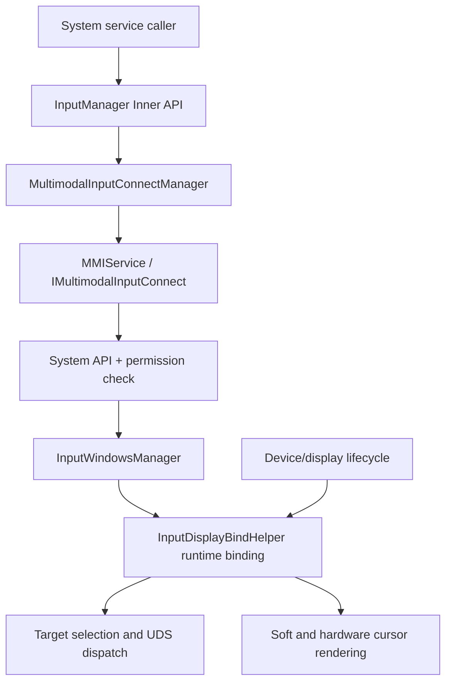
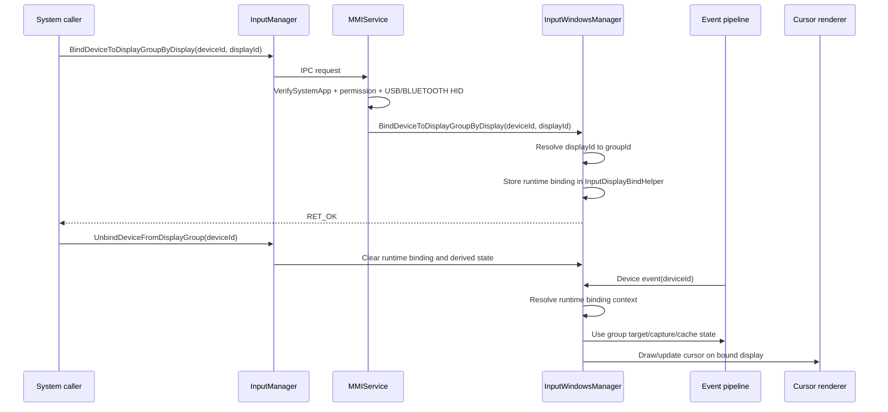

# Design

## 需求基线摘要

新增 Inner API `BindDeviceToDisplayGroupByDisplay(deviceId, displayId)`，由系统服务把蓝牙/USB HID 标准设备绑定到 `displayId` 所属 display group；新增 `UnbindDeviceFromDisplayGroup(deviceId)` 支持系统服务主动解除绑定。绑定是运行时关系：显式解绑、设备下线、显示下线、display group 消失或多模输入 SA 重启后解除。绑定后该设备所有目标敏感状态都按绑定 group 隔离，未绑定路径保持默认行为和懒分配。

## 设计约束

1. 高频路径不得在每次 move/draw 中增加全量扫描、字符串拼接或 INFO 日志。
2. 设备分类保持显式：鼠标/键盘/触控板/手写笔/手写板/远端/虚拟输入不折叠成单一鼠标逻辑。
3. 默认组状态只用于默认初始化和遗留全局 API；绑定事件链必须使用解析出的 group 上下文。
4. 可选 group 状态保持懒分配，未绑定场景不预分配非默认 group 的分发或渲染状态。
5. 软光标 RS 链路和硬光标 CPU/HWC buffer + RS buffer 链路都必须使用同一绑定上下文。
6. 运行时绑定不持久化，不通过 connect manager 在 SA 重启后重放。
7. 现有 main/default display group 使用点必须逐点分类；事件链中已解析出绑定 group 的路径不得继续隐式使用 `MAIN_GROUPID`、`DEFAULT_GROUP_ID` 或 default display group helper。
8. 真实服务验证必须基于运行中的 `mmi_service`、内核 `/dev/uinput` 虚拟设备、mmi listener 分发输出和 `hidumper` 状态输出；单元测试不能替代多 display group 的板侧证据。

## 非目标

- 不修改三方 Public API。
- 不改变触摸屏原生触摸映射。
- 不把现有持久 `SetDisplayBind` 配置语义强行替换为运行时绑定语义；两者如需共存，运行时绑定优先用于事件路由。
- 不对所有历史全局 API 做大规模 group 化，只明确本需求影响的事件和光标状态。

## 方案概述

采用“运行时绑定表 + 已解析 group 上下文”的方案。服务端新增 `BindDeviceToDisplayGroupByDisplay` 和 `UnbindDeviceFromDisplayGroup`，先在 SA 层做系统 API 权限和设备类型校验，再由 `InputWindowsManager` 根据 `displayId` 在 `displayGroupInfoMap_` 中解析 groupId，并调用 `InputDisplayBindHelper` 写入或删除运行时绑定表 `deviceId -> {displayId, groupId}`。事件进入窗口管理/归一化后，优先查询运行时绑定表；命中时把 groupId/displayId 作为事件上下文继续传递给目标选择、捕获、窗口命中、分发缓存和光标绘制。

实现前必须完成默认组使用点盘点。当前已识别的高风险入口包括：构造期 `MAIN_GROUPID` 初始化、`FindDisplayGroupId` 失败回退 `DEFAULT_GROUP_ID`、`GetDefaultDisplayGroupInfo`/`GetConstMainDisplayGroupInfo`/`FindDisplayGroupInfo` 回退 `displayGroupInfo_`、无参 `GetDisplayInfoVector()`/`GetWindowInfoVector()`/`GetFocusWindowId()` 调用、`GetDisplayId` 中 target display 为负时回默认显示、`UpdateWindowInfo` 中非主组复用 default group 模板、`SetMouseCaptureMode` 等全局 API 直接写 `captureModeInfoMap_[MAIN_GROUPID]`、`ResetMouseLocation`/`ResetCursorPos` 等光标路径直接写主组状态。每个使用点必须在计划中归类：启动/遗留全局 API 保留默认组；绑定事件链、光标链、分发缓存链改用 resolved group 或序列快照。

状态拆分采用懒分配策略。默认组仍在构造期保留现有状态；非默认绑定组只在绑定成功或绑定设备事件首次进入时创建必要的 `mouseLocationMap_`、`cursorPosMap_`、`captureModeInfoMap_`、`pointerDrawFlagMap_` 等状态。生命周期清理集中在设备移除、显示信息更新、display group 移除和服务进程重启；清理时删除运行时绑定和由绑定派生的可选状态，不影响其他 group。

绑定切换必须保留事件序列闭环。运行时绑定只影响“新开始”的事件序列；如果 key down、mouse button down、pointer down 或 gesture begin 已经按未绑定路径发给默认 group/window，则绑定、重绑定或解绑后对应 key up、button up、pointer up/cancel、gesture end 仍使用开始事件记录的 group/window/target 快照。这样避免同一未闭环序列的开始和结束分别进入两个 display group。

光标渲染增加 group/display 解析边界。软光标路径调用 `CursorDrawingComponent`/RS 更新时使用绑定 display 的 rsId；硬光标路径在 `HandleHardwareCursor`、buffer 设置和 RS buffer 通知时使用同一个 display 上下文。这样事件目标、坐标缓存和光标渲染不会跨组串扰。

端到端验证增加 dump 可观测性。`hidumper` 输出必须覆盖多 display group 下的运行时绑定表、display group 拓扑、每个 group 的 pointer/key 状态、未闭环序列快照、软光标 RS 参数和硬光标 HWC/RS buffer 参数。dump 只报告已有状态；如果某个非默认 group 尚未懒创建，输出 `absent` 或等价空状态，不能因为 dump 查询本身创建状态。

## 架构图

## 模块影响

| 子系统 | 仓库 | 模块/路径 | 影响类型 |
|--------|------|-----------|---------|
| Inner API | foundation/multimodalinput/input | `interfaces/native/innerkits/proxy/include/input_manager.h`, `frameworks/proxy/events/src/input_manager.cpp`, `frameworks/proxy/event_handler/*` | 新增代理方法 |
| IPC | foundation/multimodalinput/input | `service/connect_manager/IMultimodalInputConnect.idl`, connect manager stub/proxy | 新增 IPC 方法 |
| SA 权限 | foundation/multimodalinput/input | `service/module_loader/src/mmi_service.cpp`, `.h` | 系统 API 和权限校验 |
| 绑定上下文 | foundation/multimodalinput/input | `service/window_manager/include/input_display_bind_helper.h`, `.cpp`, `input_windows_manager.*` | 新增运行时绑定与解析 |
| 事件状态隔离 | foundation/multimodalinput/input | `service/window_manager/src/input_windows_manager.cpp`, pointer dispatch cache | 绑定事件按 group 使用状态 |
| 光标渲染 | foundation/multimodalinput/input | `cursor_drawing_component.*`, `pointer_drawing_manager.*`, `screen_pointer.*` | 软/硬光标使用绑定 display |
| Dump/诊断 | foundation/multimodalinput/input | `service/event_dump/*`, `InputWindowsManager::Dump`, `InputDeviceManager::Dump`, `PointerDrawingManager::Dump` | 输出多组绑定、分发状态、RS/HWC 参数用于板侧验证 |

## 关键设计决策

| 决策 ID | 问题 | 推荐方案 | 备选方案 | 选择理由 |
|---------|------|----------|----------|---------|
| D1 | 绑定关系是否持久化 | 运行时绑定，不写配置，不在 SA 重启后恢复 | 复用现有 `SetDisplayBind` 持久绑定 | 需求明确 SA 重启自动解除，运行时表语义更清晰 |
| D2 | API 入参使用 display 还是 group | API 使用 `displayId`，服务端解析 groupId | 直接暴露 groupId | 调用方通常持有屏幕 id；display group 是输入内部路由模型 |
| D3 | 状态隔离策略 | 默认组保留，绑定组懒分配独立状态 | 构造期为所有 group 预分配 | 满足未绑定场景 RAM/ROM 尽量不新增 |
| D4 | 光标如何 group 化 | 事件上下文携带 group/display，软硬两条路径统一消费 | 只在窗口命中层切 group | 只切分发会导致光标渲染串屏 |
| D5 | 是否提供显式解绑 | 新增 `UnbindDeviceFromDisplayGroup(deviceId)` | 只依赖设备/显示/SA 生命周期清理 | 系统服务需要主动释放设备绑定；生命周期清理无法覆盖用户主动切换或策略撤销 |
| D6 | 默认组使用点处理 | 先盘点分类，再按事件链改 resolved group | 只在新增路径处理绑定 group | 现有代码存在大量默认组 helper，未盘点会导致绑定事件漏走默认组 |

## 状态归属与不变量

### 状态归属

| 状态/上下文 | Owner | Key/索引 | 创建时机 | 清理触发 | 只读消费者 |
|-------------|-------|----------|----------|----------|------------|
| 运行时设备到显示组绑定 | `InputDisplayBindHelper` | `deviceId -> {displayId, groupId}` | `BindDeviceToDisplayGroupByDisplay` 权限、设备、display/group 校验全部通过后 | `UnbindDeviceFromDisplayGroup`、设备下线、display 下线、display group 移除、同 device 重绑定、多模输入 SA 重启 | `InputWindowsManager` 事件路由、生命周期清理、光标上下文解析 |
| displayId 到 groupId 解析结果 | `InputWindowsManager` | 当前 `displayGroupInfoMap_` 中的 `displayId` | 绑定调用时或显示拓扑变化清理时解析 | display/group 拓扑变化后重新校验，旧绑定按 display/group 清理 | `InputDisplayBindHelper` 仅保存已解析结果；事件路径只读绑定结果 |
| group 级事件状态 | `InputWindowsManager` | `groupId`，沿用 `mouseLocationMap_`、`cursorPosMap_`、`captureModeInfoMap_`、`pointerDrawFlagMap_` 等 group-keyed 状态 | 默认组按现有初始化；非默认绑定组只在绑定成功或绑定事件首次需要状态时懒创建 | group 移除、绑定覆盖、绑定设备/display 清理时清理派生状态 | 鼠标/键盘/触控板事件目标选择、捕获、坐标、UDS 分发 |
| pointer/UDS 分发缓存 | 分发缓存所属现有模块；若本需求新增字段，必须由该缓存模块以 `groupId` 或事件上下文快照为 key 管理 | `deviceId` + resolved `groupId` 或不可变事件上下文 | 绑定事件进入对应分发路径且现有缓存需要记录目标时 | 事件序列结束、group 清理、绑定清理、连接断开 | `InputWindowsManager` 和 UDS 分发路径 |
| 事件序列目标快照 | 序列所属分发/cache 模块；`InputWindowsManager` 在开始事件解析后写入上下文 | `deviceId` + key/button/pointer/gesture sequence id | key down、button down、pointer down、gesture begin 等开始事件完成目标解析后 | 对应 key up、button up、pointer up/cancel、gesture end 分发完成；设备下线；SA 重启 | key/pointer/gesture end/cancel 分发、UDS 投递、状态清理 |
| 键盘按下态与修饰键状态 | 现有 key dispatch/状态模块；本需求新增隔离时按 resolved group 或序列快照扩展 key | 未绑定使用现有共享状态；绑定后使用 `groupId` + `deviceId` 或 resolved group key | 绑定键盘新 key down 进入绑定 group 后 | key up/cancel、设备下线、解绑、group 清理、SA 重启 | key focus dispatch、modifier 计算、重复键处理 |
| 软光标显示上下文 | `InputWindowsManager` 持有 resolved display/group 事件上下文，`CursorDrawingComponent` 只消费渲染参数 | `groupId/displayId/rsId` | 绑定鼠标走软光标路径时按事件上下文传入 | 绑定清理、group/display 清理、软光标组件现有生命周期 | RS 软光标更新链路 |
| 硬光标显示上下文与 buffer 目标 | 硬光标绘制/管理模块持有 buffer 资源；`InputWindowsManager` 负责传入 resolved display/group 上下文 | `displayId` 或硬件路径已有 display/buffer key，必要时补 `groupId` | 绑定鼠标走硬光标路径并需要 CPU/HWC/RS buffer 更新时 | display 下线、group 清理、绑定清理、硬光标模块现有 buffer 释放 | CPU 绘制、HWC buffer 设置、RS buffer 通知 |
| connect manager 绑定恢复缓存 | `MultimodalInputConnectManager` 继续只持有既有 `SetDisplayBind` 恢复缓存 | 既有持久绑定 key | 新运行时 API 不创建该缓存 | SA 重启不重放 `BindDeviceToDisplayGroupByDisplay` | 仅既有 `SetDisplayBind` 兼容路径 |
| hidumper 多组诊断视图 | `EventDump` 协调各模块 dump；状态 owner 仍是原模块 | dump section 名称和只读快照 | 调用 `hidumper -s 3101` 时只读生成 | dump 调用结束即释放临时字符串 | 板侧测试和问题定位 |

### 设计不变量

| 类型 | 不变量 | 验证方式 |
|------|--------|----------|
| Hot path | 每次 move/draw/key/pointer dispatch 不扫描 `displayGroupInfoMap_`，不做字符串格式化，不新增 INFO 日志；事件路径只按 `deviceId` 查询已解析绑定上下文。 | `InputWindowsManagerTest` 覆盖绑定事件；代码审查确认 display 扫描只在绑定/拓扑清理路径。 |
| Compatibility | 未绑定设备保持当前默认行为；窗口级 pointer style/custom cursor/capture 仍按窗口所属 group；全局 pointer size/color/speed/visible/location/capture 仍只作用默认组。 | 现有 pointer/window API 回归测试 + 新增 AC-5.1/AC-5.2 测试。 |
| Lifecycle | 显式解绑、设备下线、display 下线、display group 移除、同 device 重绑定、多模输入 SA 重启后，运行时绑定和绑定派生状态必须清理；connect manager 不重放新 API。 | AC-1.5、AC-3.1 - AC-3.4 单元测试和 SA 重启 no-replay 测试。 |
| State ownership | 运行时绑定唯一 owner 是 `InputDisplayBindHelper`；`InputWindowsManager` 只解析拓扑和消费上下文；渲染组件只消费 display/group 参数，不拥有绑定表。 | `InputDisplayBindHelperTest`、`InputWindowsManagerTest`、execution-plan Task state ownership 审查。 |
| Default group audit | `MAIN_GROUPID`、`DEFAULT_GROUP_ID`、default display group helper 和无参 group helper 使用点必须有分类结论；绑定事件链不得隐式回主组。 | 代码审查清单 + AC-5.4 多 group 回归测试。 |
| Lazy allocation | 未绑定启动和未绑定事件不得创建非默认 group 的绑定、分发或渲染上下文；非默认状态只在绑定成功或绑定事件首次需要时创建。 | AC-2.4/AC-5.3 map/context size 测试。 |
| Multi-device baseline | 两个未绑定鼠标/键盘必须保持现有共享状态语义；绑定后才按 resolved group 拆分 cursor position、颜色、大小、样式、surface node、mouse location、焦点、pressed-key 和 modifier 状态。 | AC-2.5/AC-2.6 双设备双显示组测试。 |
| Sequence closure | 绑定、重绑定、解绑不得改变已开始未闭环序列的结束目标；结束事件必须按开始事件的 group/window/target 快照闭环。 | AC-2.7 key/button/pointer/gesture begin-before-bind 与 end-after-bind 测试。 |
| Device classification | USB/BLUETOOTH HID 校验在 SA 入口完成；鼠标、键盘、触控板、手写笔、手写板、远端、虚拟输入分类保持显式，不折叠成通用鼠标路径。 | `MMIServiceTest` 设备类型分支 + 触控板/非触控设备分类回归测试。 |
| Cursor rendering | 软光标 RS 路径和硬光标 CPU/HWC buffer + RS buffer 路径必须消费同一个 resolved display/group 上下文。 | `CursorDrawingComponentTest`、`PointerDrawingManagerTest`、双屏板侧软/硬光标证据。 |
| Dump observability | `hidumper` 必须能同时看到绑定表、display group、per-group pointer/key 状态、序列快照、RS 软光标参数和 HWC 硬光标参数；dump 不得触发懒状态创建。 | 真实 `mmi_service` 板侧验证记录 listener 输出与 `hidumper` 输出，并用未绑定 dump 前后状态证明无额外分配。 |

## Hidumper 输出要求

| Section | 必要字段 | 验证用途 |
|---------|----------|----------|
| `RuntimeBindings` | `deviceId`, `displayId`, `groupId`, connection type, binding state, cleanup reason when available | 确认 bind/unbind、设备/显示下线和 SA 重启后的绑定状态 |
| `DisplayGroups` | `groupId`, display list, main display, focus window id | 确认 displayId 到 groupId 解析和键盘焦点隔离 |
| `PointerStateByGroup` | `groupId`, cursor position, mouse location, pointer style, color, size, capture mode, surface node id/pointer, active pointer sequences | 确认双鼠标未绑定共享状态、绑定后按组隔离 |
| `KeyboardStateByGroup` | `groupId`, focus window id, pressed keys, modifier state, active key sequences | 确认双键盘未绑定共享状态、绑定后按组隔离 |
| `SequenceSnapshots` | `deviceId`, sequence type/id, begin group/window/display, current binding group/display, close target, pending-close flag | 确认 begin-before-bind 与 end-after-bind 的事件闭环 |
| `SoftCursorRS` | `groupId`, `displayId`, rsId/screenId, surface node id, position, style, size, color, visible state | 确认软光标 RS 参数使用绑定 display |
| `HardwareCursor` | `groupId`, `displayId`, screenId, buffer id, buffer size, position, style, enabled/visible state, RS buffer node id | 确认 CPU/HWC buffer 与 RS buffer 使用绑定 display |
| `DispatchListeners` | listener pid/uid or identity, last event device/action, target group/display/window | 用 listener 输出和 dump 输出交叉验证真实分发目标 |

## 时序设计

## 风险与缓解

| 风险 | 可能性 | 影响 | 缓解措施 |
|------|--------|------|----------|
| 事件分发使用绑定组但光标仍使用默认显示 | 中 | 多屏体验错误 | 任务单独覆盖软光标和硬光标路径，并要求板侧证据 |
| 新增状态导致未绑定路径内存增长 | 中 | 违背约束 | 非默认状态只在绑定成功或绑定事件命中时创建，测试检查 map 不增长 |
| 现有 `SetDisplayBind` 与新运行时绑定语义混淆 | 中 | 重启恢复或配置污染 | 新 API 独立命名，connect manager 不缓存重放新运行时绑定 |
| 高频路径引入 display->group 全量查找 | 中 | move/draw 性能回退 | 绑定时解析并缓存 groupId；事件路径只按 deviceId 哈希查询 |
| 全局 API 被误改为多组生效 | 低 | API 兼容破坏 | spec 明确全局 API 仅默认组；测试覆盖捕获/位置等现有行为 |

## 验证思路

| 验证场景 | 方法 | 通过标准 |
|----------|------|----------|
| 权限拒绝 | mock 非系统应用或缺少权限调用新 API | 返回 `ERROR_NO_PERMISSION`，绑定表不变 |
| display 解析 group | 构造两个 display group，绑定 device 到 group 1 的 display | 绑定表记录 group 1，事件目标只来自 group 1 |
| 生命周期清理 | 绑定后模拟设备移除、显示移除、group 移除、SA 重启 | 绑定表清空，后续事件不读取已删除 group 状态 |
| 懒分配 | 未绑定事件和只读查询后检查非默认状态 map | 不创建额外 group 状态 |
| 软光标 | 禁用硬光标或走 RS 软光标测试路径 | RS 更新使用绑定 display rsId |
| 硬光标 | 启用硬光标路径移动绑定鼠标 | HWC buffer 和 RS buffer 使用绑定 display |
| 真实服务集成 | 运行真实 `mmi_service`，用 `/dev/uinput` 创建 A/B 鼠标和 A/B 键盘，通过调用 `InputManager::UpdateDisplayInfo` 构造两个 display group，注册 listener 收集分发输出 | listener 目标 group/window 与 `hidumper` 的绑定、状态、RS/HWC 参数一致 |
| dump 完整性 | 执行 `hidumper -s 3101` 获取多组状态 | 输出包含 `RuntimeBindings`、`DisplayGroups`、per-group pointer/key 状态、`SequenceSnapshots`、`SoftCursorRS`、`HardwareCursor`，且 dump 不创建 absent group 状态 |
| 回归 | 运行现有窗口/绑定/光标单测 | 默认组行为保持 |
