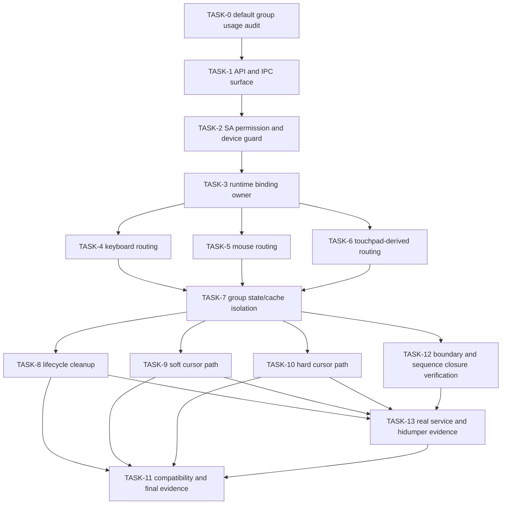

# HID Display Group Binding Execution Plan

> 本文件是 AI 代码实现入口。执行时以 `spec.md` 的 AC 为权威，使用 `superpowers:subagent-driven-development` 或 `superpowers:executing-plans` 按 Task 顺序推进。每个 Task 必须先补失败测试或明确证据缺口，再做最小实现，最后回填验证结果。

## Input Status

| Input | Path | Status | Implementation Role |
|------|------|--------|---------------------|
| Proposal | `proposal.md` | Draft, direction approved | Scope and motivation only |
| Design | `design.md` | Draft, direction approved | Architecture constraints |
| Spec | `spec.md` | Draft, implementation authority | AC, business rules, error behavior |
| Knowledge | `docs/knowledge/display-group-model.md` | Read before code | Group/focus/capture/default fallback rules |
| Knowledge | `docs/knowledge/input-device-scope.md` | Read before code | Device/display binding and lifecycle rules |
| Knowledge | `docs/knowledge/input-context-state.md` | Read before code | Cursor/cache/lazy state rules |
| Knowledge | `docs/knowledge/input-event-pipeline.md` | Read before event path edits | Target selection, coordinate and dispatch flow |
| Knowledge | `docs/knowledge/board-verification.md` | Read before final evidence | Build and board verification requirements |

## Execution Principles

| Principle | Required Behavior |
|-----------|-------------------|
| Spec authority | If implementation detail conflicts with `spec.md`, stop and update design/spec before code. |
| Test first | Each Task starts with a failing unit test or an explicit board-evidence gap when unit coverage is impossible. |
| Small tasks | Do not merge unrelated routing, cursor and lifecycle changes into one commit-sized change. |
| File boundaries | Only edit files listed in the Task unless a failing build exposes an additional required declaration or test fixture. |
| State ownership | Runtime `deviceId -> displayId/groupId` binding is owned by `InputDisplayBindHelper`; `InputWindowsManager` resolves display topology and consumes the binding. |
| Default-group audit first | Before routing edits, classify every touched `MAIN_GROUPID`, `DEFAULT_GROUP_ID`, default display group helper and no-arg group helper use as either legacy-default-only or resolved-group-required. |
| Hot path discipline | No full display-group scan, string formatting, heap allocation or INFO log may be added to per-move/per-draw paths. |
| Lazy state | Non-default group dispatch/render state is allocated only after a successful binding or after existing topology code already creates that group. |
| Real service evidence | Multi-display-group completion requires real `mmi_service`, `/dev/uinput` virtual devices, mmi listener output and `hidumper` output; unit tests alone are insufficient. |
| Dump is read-only | `hidumper` may format existing state, but must not allocate binding, dispatch or render state for absent non-default groups. |
| Evidence backfill | After each Task passes, update `spec.md` code mapping and this plan's Actual Result field with concrete commands or board evidence. |
| Anti-fake completion | A Task is incomplete if tests were not run, expected failures were not observed first, or only declarations were added without event-path evidence. |

## AC To Task Trace

| AC | Task | Verification |
|----|------|--------------|
| AC-1.1 | TASK-1, TASK-2, TASK-3 | API/IPC, permission and binding-model tests |
| AC-1.2 | TASK-2 | Permission denial tests |
| AC-1.3 | TASK-2, TASK-3 | Invalid device/display tests |
| AC-1.4 | TASK-3 | Rebind overwrite and stale-state cleanup tests |
| AC-1.5 | TASK-1, TASK-2, TASK-3, TASK-8 | Explicit unbind API, permission and cleanup tests |
| AC-2.1 | TASK-5, TASK-7 | Mouse target/capture/location/UDS tests |
| AC-2.2 | TASK-4 | Keyboard focus-by-group tests |
| AC-2.3 | TASK-6 | Touchpad-derived pointer/gesture group tests |
| AC-2.4 | TASK-7, TASK-11 | Unbound default-path and lazy-state tests |
| AC-2.5 | TASK-7, TASK-9, TASK-10, TASK-12 | Dual mouse shared-baseline and bound-isolation tests |
| AC-2.6 | TASK-4, TASK-7, TASK-12 | Dual keyboard focus/pressed/modifier shared-baseline and bound-isolation tests |
| AC-2.7 | TASK-7, TASK-12 | Begin-before-bind/end-after-bind sequence closure tests |
| AC-3.1 | TASK-8 | Device offline cleanup tests |
| AC-3.2 | TASK-8 | Display/group offline cleanup tests |
| AC-3.3 | TASK-8 | SA restart/connect-manager no-replay tests |
| AC-3.4 | TASK-8 | Post-cleanup event safety tests |
| AC-4.1 | TASK-9 | Soft cursor RS display-context tests |
| AC-4.2 | TASK-10 | Hardware cursor CPU/HWC/RS-buffer display-context tests |
| AC-4.3 | TASK-7, TASK-9, TASK-10 | Multi-group cursor/display/capture isolation tests |
| AC-5.1 | TASK-11 | Window-scoped API regression tests |
| AC-5.2 | TASK-11 | Global API default-group regression tests |
| AC-5.3 | TASK-7, TASK-11 | Startup/unbound memory-state checks |
| AC-5.4 | TASK-0, TASK-4, TASK-5, TASK-6, TASK-7, TASK-11 | Default/main display group usage audit and multi-group regression |
| AC-6.1 | TASK-13 | Real `mmi_service`, `/dev/uinput`, display group and listener evidence |
| AC-6.2 | TASK-13 | Dual mouse/keyboard unbound, bound, unbound and cleanup listener evidence |
| AC-6.3 | TASK-13 | `hidumper -s 3101` runtime binding, group, pointer/key and sequence dump |
| AC-6.4 | TASK-13 | `hidumper` RS soft cursor and HWC hard cursor parameter dump |
| AC-6.5 | TASK-13 | Dump no-allocation checks for absent lazy state |

## Implementation Boundaries

**Must implement:** new Inner APIs `BindDeviceToDisplayGroupByDisplay` and `UnbindDeviceFromDisplayGroup`, IPC and proxy forwarding, SA system/permission guard, USB/BLUETOOTH HID validation, runtime binding table, displayId-to-groupId resolution, event routing by resolved group, explicit and lifecycle cleanup, soft and hard cursor display-context isolation, default/main display group usage audit, compatibility regression tests, multi-display-group `hidumper` diagnostic output, and real `mmi_service` integration evidence.

**Must preserve:** existing `SetDisplayBind` behavior, old global pointer API default-group semantics, window-scoped API behavior by window group, existing display topology lifecycle behavior, unbound device behavior.

**May defer:** richer error-code enum beyond current `RET_ERR`/`ERROR_NO_PERMISSION`, support for non-USB/BLUETOOTH or non-HID device classes.

## Prohibitions

- Do not persist the new runtime binding in `input_device_name.cfg` or existing display-bind storage.
- Do not replay `BindDeviceToDisplayGroupByDisplay` from `MultimodalInputConnectManager` after SA restart.
- Do not reuse default group state for a bound non-default group except through explicit default fallback in legacy helpers.
- Do not collapse stylus, tablet, touchpad, remote or virtual-device rules into a generic mouse rule.
- Do not add per-event scans of `displayGroupInfoMap_`; resolve and cache group context at bind/topology change time.
- Do not mark cursor work complete unless both soft RS and hard CPU/HWC/RS-buffer paths have evidence.
- Do not leave a touched default-group helper call unclassified; every `MAIN_GROUPID`, `DEFAULT_GROUP_ID`, `GetDefaultDisplayGroupInfo`, `GetConstMainDisplayGroupInfo`, no-arg `GetDisplayInfoVector`/`GetWindowInfoVector`/`GetFocusWindowId` use must be justified or changed.
- Do not mark verification complete with only unit tests; the final evidence must include real service listener output and `hidumper` output for two display groups.
- Do not let dump code call lazy creation helpers for absent non-default group state.

## Dependency Graph

## Task List

| Task | Goal | AC | Depends On | Primary Verification |
|------|------|----|------------|----------------------|
| TASK-0 | Audit default/main display group usage points | AC-5.4 | None | audit table + targeted `InputWindowsManagerTest` plan |
| TASK-1 | Add bind/unbind API/IPC/proxy surface | AC-1.1, AC-1.5 | TASK-0 | `MultimodalInputConnectStubTest`, `InputManagerTest` |
| TASK-2 | Add SA permission and device guard | AC-1.1, AC-1.2, AC-1.3, AC-1.5 | TASK-1 | `MMIServiceTest` |
| TASK-3 | Add runtime binding owner, unbind and display-to-group resolution | AC-1.1, AC-1.3, AC-1.4, AC-1.5 | TASK-2 | `InputDisplayBindHelperTest`, `InputWindowsManagerTest` |
| TASK-4 | Route keyboard events by bound group focus | AC-2.2 | TASK-3 | `InputWindowsManagerTest` |
| TASK-5 | Route mouse events by bound group state | AC-2.1 | TASK-3 | `InputWindowsManagerTest` |
| TASK-6 | Route touchpad-derived events without broad device-class folding | AC-2.3 | TASK-3 | touchpad/window-manager tests |
| TASK-7 | Isolate and lazily allocate group state/cache | AC-2.4, AC-4.3, AC-5.3 | TASK-4, TASK-5, TASK-6 | `InputWindowsManagerTest`, cache tests if touched |
| TASK-8 | Clean runtime bindings on lifecycle changes | AC-3.1 - AC-3.4 | TASK-7 | `InputWindowsManagerTest`, connect-manager tests |
| TASK-9 | Bind soft cursor RS path to target display | AC-4.1, AC-4.3 | TASK-7 | `CursorDrawingComponentTest`, `InputWindowsManagerTest` |
| TASK-10 | Bind hard cursor CPU/HWC/RS-buffer path to target display | AC-4.2, AC-4.3 | TASK-7 | `PointerDrawingManagerTest`, board evidence |
| TASK-12 | Verify multi-device boundary and sequence closure | AC-2.5, AC-2.6, AC-2.7 | TASK-7 | `InputWindowsManagerTest`, dispatch cache tests |
| TASK-13 | Prove real service dispatch and complete hidumper observability | AC-6.1 - AC-6.5 | TASK-8, TASK-9, TASK-10, TASK-12 | real `mmi_service`, `/dev/uinput`, listener logs, `hidumper -s 3101` |
| TASK-11 | Prove compatibility, default behavior and final build | AC-5.1 - AC-5.4 | TASK-8, TASK-9, TASK-10, TASK-12, TASK-13 | `build.sh --build-target input`, board evidence |

## Task Details

### TASK-0: Default/Main Display Group Usage Audit

**Goal:** Produce a code-level classification of default/main display group usage before event routing edits.

**AC Mapping:** AC-5.4

**Dependencies:** None

**Non-goals:** No implementation changes in this Task except tests or notes needed to make the audit executable.

**State Ownership:** No new runtime state. This Task defines which existing default-group state remains legacy-default-only and which call sites must consume resolved group context.

**Read-Only Context**

| Path | Read For |
|------|----------|
| `docs/knowledge/display-group-model.md` | Default group boundary rules |
| `docs/knowledge/input-context-state.md` | State/cache key and lazy allocation rules |
| `service/window_manager/include/input_windows_manager.h` | Default arguments and helper declarations |
| `service/window_manager/src/input_windows_manager.cpp` | `MAIN_GROUPID`, `DEFAULT_GROUP_ID`, default helper and cursor/capture call sites |

**Files**

| Operation | Path | Reason |
|-----------|------|--------|
| Modify | `.codespec/changes/draft-20260528-hid-display-binding/execution-plan.md` | Backfill audit table and Actual Result |
| Test | `service/window_manager/test/input_windows_manager_test.cpp` | Add targeted multi-group tests for high-risk default-group fallbacks |

**Steps**

- [x] Run `rg -n "MAIN_GROUPID|DEFAULT_GROUP_ID|GetDefaultDisplayGroupInfo|GetConstMainDisplayGroupInfo|FindDisplayGroupInfo|GetDisplayInfoVector\\(|GetWindowInfoVector\\(|GetFocusWindowId\\(|GetDisplayId\\(|captureModeInfoMap_\\[MAIN_GROUPID\\]|mouseLocationMap_\\[MAIN_GROUPID\\]|cursorPosMap_\\[MAIN_GROUPID\\]" service/window_manager/include/input_windows_manager.h service/window_manager/src/input_windows_manager.cpp`.
- [x] Classify each touched use point as `legacy-default-only`, `startup-default-init`, `topology-fallback`, or `resolved-group-required`.
- [x] For each `resolved-group-required` point, record the Task that will change it: keyboard TASK-4, mouse TASK-5, touchpad TASK-6, cache/state TASK-7, cursor TASK-9/TASK-10, compatibility TASK-11.
- [x] Add failing multi-group tests for at least these high-risk groups: key focus fallback, mouse capture fallback, cursor reset/location fallback, and `GetDisplayId` negative-display fallback.
- [x] Backfill the audit table below before starting TASK-1.

**Default Group Audit Table (completed by TASK-0 audit)**

| Use Point | File:Line | Current Pattern | Classification | Required Action | Owning Task |
|-----------|-----------|-----------------|----------------|-----------------|-------------|
| Constructor: `displayGroupInfo_.groupId` | cpp:194 | `displayGroupInfo_.groupId = MAIN_GROUPID` | startup-default-init | Keep; initializes singleton default group info | TASK-7 |
| Constructor: `displayGroupInfoMap_[MAIN_GROUPID]` | cpp:198 | Seeds default group in map | startup-default-init | Keep as-is; secondary groups added lazily via UpdateDisplayInfo | TASK-7 |
| Constructor: `displayGroupInfoMapTmp_[MAIN_GROUPID]` | cpp:199 | Seeds tmp map for default group | startup-default-init | Keep; secondary entries created by UpdateWindowInfo | TASK-7 |
| Constructor: `backCenterDisplayChangeMap_[MAIN_GROUPID]` | cpp:200 | Initializes flag for default group | startup-default-init | Keep; per-group entries created on demand | TASK-7 |
| Constructor: `captureModeInfoMap_[MAIN_GROUPID]` | cpp:201 | Initializes capture for default group | startup-default-init | Keep default init; event lookup must use resolved group | TASK-5, TASK-7 |
| Constructor: `pointerDrawFlagMap_[MAIN_GROUPID]` | cpp:202 | Initializes draw flag for default group | startup-default-init | Keep | TASK-7 |
| Constructor: `mouseLocationMap_[MAIN_GROUPID]` | cpp:203 | Initializes mouse location for default group | startup-default-init | Keep; secondary groups need lazy init | TASK-5, TASK-7 |
| Constructor: `windowsPerDisplayMap_[MAIN_GROUPID]` | cpp:204 | Initializes per-display windows for default group | startup-default-init | Keep | TASK-7 |
| Constructor: `lastPointerEventForWindowChangeMap_[MAIN_GROUPID]` | cpp:205 | Initializes last event map for default group | startup-default-init | Keep | TASK-7 |
| Constructor: `displayModeMap_[MAIN_GROUPID]` | cpp:206 | Initializes display mode for default group | startup-default-init | Keep | TASK-7 |
| Constructor: `lastDpiMap_[MAIN_GROUPID]` | cpp:207 | Initializes DPI for default group | startup-default-init | Keep | TASK-7 |
| Constructor: `cursorPosMap_[MAIN_GROUPID]` | cpp:209 | Initializes cursor position for default group | startup-default-init | Keep; secondary groups need lazy init | TASK-9, TASK-10, TASK-7 |
| `FindDisplayGroupId` miss | cpp:673 | Returns `DEFAULT_GROUP_ID` when displayId not found in any group | topology-fallback | Keep for legacy; bound API must reject invalid display | TASK-3 |
| `GetDefaultDisplayGroupInfo` | cpp:688-696 | Iterates map for GROUP_DEFAULT type, falls back to `displayGroupInfo_` | topology-fallback | Bound event chains must not use as final resolution | TASK-4 - TASK-7 |
| `GetConstMainDisplayGroupInfo` | cpp:698-705 | Same as above (const version) | topology-fallback | Same; use resolved binding context | TASK-4 - TASK-7 |
| `FindDisplayGroupInfo` miss | cpp:707-714 | Returns `displayGroupInfo_` when displayId not in any group | topology-fallback | Same; use resolved binding context | TASK-4 - TASK-7 |
| `HandleKeyEventWindowId`: `GetFocusWindowId(groupId)` | cpp:755 | Uses `FindDisplayGroupId` result to get focus; falls back to MAIN if miss | resolved-group-required | Pass resolved group from device binding | TASK-4 |
| `GetDisplayId` negative fallback | cpp:801-823 | When targetDisplayId < 0, calls FindDisplayGroupId(-1) -> DEFAULT_GROUP_ID, resolves to main group's first display | resolved-group-required | Derive display from device binding context | TASK-4, TASK-5 |
| `GetPidAndUpdateTarget`: `GetFocusWindowId(groupId)` | cpp:880 | Keyboard target uses FindDisplayGroupId -> GetFocusWindowId | resolved-group-required | Pass resolved group from device binding | TASK-4 |
| `CheckFocusWindowChange`: `GetFocusWindowId(displayGroupInfo.groupId)` | cpp:975 | Uses incoming displayGroupInfo's groupId | legacy-default-only | Already group-aware via parameter; keep | -- |
| `UpdateWindowInfo`: `if (it.first != MAIN_GROUPID)` | cpp:1099,1113 | Special handling for non-main groups in incremental window update | legacy-default-only | Existing multi-group dispatch logic; keep | -- |
| `UpdateWindowInfo`: `GetDefaultDisplayGroupInfo()` | cpp:1112 | Fallback when group not in tmp map | topology-fallback | Bound paths should never reach this fallback | TASK-7 |
| `UpdateDisplayInfoExtIfNeed`: `groupId != DEFAULT_GROUP_ID` | cpp:1187 | Early return for non-default groups (skips touch drawing, triple-finger) | legacy-default-only | Keep; touch drawing is main-display-only feature | -- |
| `IsPointInsideSpecialWindow`: `GetWindowInfoVector()` (no-arg) | cpp:1716 | No-arg defaults to DEFAULT_GROUP_ID | resolved-group-required | Should use resolved group for VKEYBOARD context | TASK-5 |
| `IsMouseInCastWindow`: `GetWindowInfoVector()` (no-arg) | cpp:1734 | No-arg defaults to DEFAULT_GROUP_ID | resolved-group-required | Should use resolved group | TASK-5 |
| `IsCaptureMode`: `GetWindowInfoVector()` (no-arg) | cpp:1749 | No-arg defaults to DEFAULT_GROUP_ID | resolved-group-required | Should use resolved group | TASK-5 |
| `JudgeCameraInFore`: `GetFocusWindowId(MAIN_GROUPID)`, `GetMainDisplayId(MAIN_GROUPID)` | cpp:2006-2007 | Hardcodes MAIN_GROUPID for camera check | legacy-default-only | Camera check is intentionally main-display-only | -- |
| `InitDisplayGroupInfo`: `groupId != MAIN_GROUPID` check | cpp:2026 | Validates GROUP_DEFAULT type only for MAIN_GROUPID | legacy-default-only | Correct constraint; GROUP_DEFAULT singleton | -- |
| `GetDisplayMode`: `displayModeMap_.find(MAIN_GROUPID)` | cpp:2240 | Hardcodes MAIN_GROUPID lookup | resolved-group-required | Add groupId parameter | TASK-7 |
| `NotifyPointerToWindow`: `GetFocusWindowId(groupId)` | cpp:2420 | Uses groupId parameter (defaults to DEFAULT_GROUP_ID) | resolved-group-required | Callers must pass resolved group | TASK-5, TASK-6 |
| `DispatchPointer`: `GetWindowInfo(..., MAIN_GROUPID)` | cpp:2611 | Hardcodes MAIN_GROUPID for window lookup | resolved-group-required | Pass resolved group | TASK-5 |
| `DispatchPointer`: `GetWindowInfo(..., MAIN_GROUPID)` | cpp:2698 | Hardcodes MAIN_GROUPID for window lookup | resolved-group-required | Pass resolved group | TASK-5 |
| `DispatchPointer`: `GetDefaultDisplayGroupInfo()` | cpp:2717 | Gets default group info for enter-window event | resolved-group-required | Use resolved group context | TASK-5 |
| `DispatchPointer`: `mouseLocationMap_.find(MAIN_GROUPID)` | cpp:2722 | Hardcodes MAIN_GROUPID for mouse location | resolved-group-required | Use per-group mouse location | TASK-5 |
| `FindPhysicalDisplayInfo` miss | cpp:3178 | Falls back to MAIN_GROUPID first display when uniq not found | topology-fallback | Keep as last-resort fallback | -- |
| `GetDisplayGroupInfo` | cpp:3493-3500 | Returns group info by groupId, falls back to `displayGroupInfo_` | topology-fallback | Keep fallback; callers should use resolved group | TASK-5, TASK-6 |
| `GetDisplayInfoVector` fallback | cpp:3502-3515 | Falls back to MAIN_GROUPID then `displayGroupInfo_` | topology-fallback | Keep fallback chain; callers must pass correct groupId | TASK-4 - TASK-7 |
| `GetWindowInfoVector` fallback | cpp:3527-3540 | Falls back to MAIN_GROUPID then `displayGroupInfo_` | topology-fallback | Keep fallback chain; callers must pass correct groupId | TASK-4 - TASK-7 |
| `GetFocusWindowId` fallback | cpp:3542-3553 | Falls back to MAIN_GROUPID when groupId not found | topology-fallback | Keep fallback; callers must pass resolved group | TASK-4 - TASK-7 |
| `UpdatePointerChangeAreas()`: `displayGroupInfoMapTmp_.find(MAIN_GROUPID)` | cpp:4481 | Hardcodes MAIN_GROUPID for pointer change areas | resolved-group-required | Should use resolved group | TASK-5, TASK-6 |
| `SetMouseCaptureMode`: `captureModeInfoMap_.find(MAIN_GROUPID)` | cpp:5223 | Hardcodes MAIN_GROUPID for capture mode set | resolved-group-required | Per-group capture state needed for bound devices | TASK-5, TASK-7 |
| `SetMouseCaptureMode`: `captureModeInfoMap_[MAIN_GROUPID].windowId/isCaptureMode` | cpp:5229-5230 | Hardcodes MAIN_GROUPID writes | resolved-group-required | Write to resolved group's capture entry | TASK-5, TASK-7 |
| `GetMouseIsCaptureMode`: `captureModeInfoMap_.find(MAIN_GROUPID)` | cpp:5239 | Hardcodes MAIN_GROUPID for capture mode check | resolved-group-required | Query resolved group's capture state | TASK-5, TASK-7 |
| `ProcessInjectEventGlobalXY`: `GetDefaultDisplayGroupInfo()` | cpp:5631 | Uses default group to resolve global coordinates | resolved-group-required | Injected events need group context | TASK-5, TASK-11 |
| `GetMouseInfo`: `GetDisplayInfoVector(MAIN_GROUPID)` | cpp:7571 | Hardcodes MAIN_GROUPID for mouse info | resolved-group-required | Add groupId parameter; callers pass resolved group | TASK-5 |
| `GetMouseInfo`: `mouseLocationMap_.find(MAIN_GROUPID)` x3 | cpp:7573,7584,7586-7588 | Hardcodes MAIN_GROUPID for location read/write | resolved-group-required | Per-group mouse location | TASK-5, TASK-7 |
| `GetCursorPos`: `GetDisplayInfoVector(MAIN_GROUPID)` | cpp:7603 | Hardcodes MAIN_GROUPID for cursor pos | resolved-group-required | Add groupId parameter | TASK-9, TASK-10 |
| `GetCursorPos`: `cursorPosMap_.find(MAIN_GROUPID)` x2, writes x5 | cpp:7605,7614,7622-7627 | Hardcodes MAIN_GROUPID | resolved-group-required | Per-group cursor position | TASK-9, TASK-10 |
| `ResetCursorPos`: `GetDisplayInfoVector(MAIN_GROUPID)` | cpp:7636 | Hardcodes MAIN_GROUPID for cursor reset | resolved-group-required | Add groupId parameter | TASK-9, TASK-10 |
| `ResetCursorPos`: `cursorPosMap_.find/write(MAIN_GROUPID)` x10 | cpp:7654-7671 | Hardcodes MAIN_GROUPID | resolved-group-required | Per-group cursor reset | TASK-9, TASK-10 |
| `ReverseXY`: `GetDisplayInfoVector(MAIN_GROUPID)` | cpp:8147 | Hardcodes MAIN_GROUPID for touch coordinate reversal | resolved-group-required | Use resolved group | TASK-7 |
| `EnterMouseCaptureMode`: `groupId != DEFAULT_GROUP_ID` guard | cpp:9248 | Returns early for non-default groups | legacy-default-only | Keep; capture mode is currently main-group-only | TASK-5, TASK-11 |
| Header: 18 method signatures with `groupId = DEFAULT_GROUP_ID` | h:122,248,250,293,343,345,347,349-352,369,371,388,391,452,489,498 | Default argument in declarations | resolved-group-required (callers) | All callers in bound event paths must pass explicit groupId | TASK-4 - TASK-7 |

**Summary Statistics:**
- startup-default-init: 12 use points (constructor map initialization)
- topology-fallback: 8 use points (FindDisplayGroupId miss, Get*Info miss patterns)
- legacy-default-only: 6 use points (camera check, GROUP_DEFAULT validation, non-default early returns)
- resolved-group-required: 30+ use points across keyboard, mouse, touchpad, cursor, and cache paths

**Anti-Fake Completion**

| Check | Required Evidence |
|-------|-------------------|
| Audit exists | Table above is filled with concrete use points found by `rg` |
| Classification is actionable | Each `resolved-group-required` row names a later Task |
| Tests planned | Failing tests cover default focus, capture, display fallback and cursor/location fallback |

**Verification**

| Command | Expected Result | Actual Result |
|---------|-----------------|---------------|
| `rg -n "MAIN_GROUPID|DEFAULT_GROUP_ID|GetDefaultDisplayGroupInfo|GetConstMainDisplayGroupInfo|FindDisplayGroupInfo|GetDisplayInfoVector\\(|GetWindowInfoVector\\(|GetFocusWindowId\\(" service/window_manager/include/input_windows_manager.h service/window_manager/src/input_windows_manager.cpp` | Use points classified in this Task | DONE: 56+ use points found; 12 startup-default-init, 8 topology-fallback, 6 legacy-default-only, 30+ resolved-group-required. Audit table backfilled. 7 failing multi-group tests added to input_windows_manager_test.cpp. |

### TASK-1: API And IPC Surface

**Goal:** Expose `BindDeviceToDisplayGroupByDisplay(int32_t deviceId, int32_t displayId, std::string &msg)` and `UnbindDeviceFromDisplayGroup(int32_t deviceId, std::string &msg)` from native Inner API to MMI service IPC.

**AC Mapping:** AC-1.1, AC-1.5

**Dependencies:** TASK-0

**Non-goals:** Permission checks, display validation and runtime binding mutation.

**State Ownership:** No runtime state is introduced in this Task.

**Read-Only Context**

| Path | Read For |
|------|----------|
| `interfaces/native/innerkits/proxy/include/input_manager.h` | Existing Inner API declaration style |
| `frameworks/proxy/event_handler/src/input_manager_impl.cpp` | Existing connect-manager forwarding style |
| `service/connect_manager/IMultimodalInputConnect.idl` | IDL method and transaction conventions |
| `service/connect_manager/src/multimodal_input_connect_manager.cpp` | Existing `SetDisplayBind` forwarding and cache behavior |

**Files**

| Operation | Path | Reason |
|-----------|------|--------|
| Modify | `interfaces/native/innerkits/proxy/include/input_manager.h` | Add public bind/unbind Inner API declarations |
| Modify | `frameworks/proxy/events/src/input_manager.cpp` | Forward `InputManager` API to impl |
| Modify | `frameworks/proxy/event_handler/include/input_manager_impl.h` | Add impl declaration |
| Modify | `frameworks/proxy/event_handler/src/input_manager_impl.cpp` | Forward to connect manager |
| Modify | `service/connect_manager/IMultimodalInputConnect.idl` | Add bind/unbind IPC methods |
| Modify | `service/connect_manager/include/multimodal_input_connect_manager.h` | Add manager declaration |
| Modify | `service/connect_manager/src/multimodal_input_connect_manager.cpp` | Marshal/unmarshal IPC call |
| Test | `service/connect_manager/test/multimodal_input_connect_stub_test.cpp` | Stub transaction coverage |
| Test | `frameworks/proxy/events/test/input_manager_test.cpp` | API forwarding coverage |

**Steps**

- [ ] Add failing stub/proxy tests showing the new bind and unbind APIs or transactions do not exist.
- [ ] Run `prebuilts/build-tools/linux-x86/bin/ninja -C out/rk3568 MultimodalInputConnectStubTest InputManagerTest` and record the expected failure.
- [ ] Add declarations and forwarding only; do not cache or replay the new runtime bind/unbind calls in connect manager.
- [ ] Run the same command and record the passing result.
- [ ] Backfill `spec.md` code mapping for AC-1.1 with actual files.

**Anti-Fake Completion**

| Check | Required Evidence |
|-------|-------------------|
| API is callable | Proxy test calls `InputManager::BindDeviceToDisplayGroupByDisplay` and `InputManager::UnbindDeviceFromDisplayGroup` |
| IPC is wired | Stub test verifies bind `deviceId/displayId/msg` and unbind `deviceId/msg` handling |
| No restart replay | No write to `displayBindCache` for the new API |

**Verification**

| Command | Expected Result | Actual Result |
|---------|-----------------|---------------|
| `prebuilts/build-tools/linux-x86/bin/ninja -C out/rk3568 MultimodalInputConnectStubTest InputManagerTest` | New API/IPC tests pass | Pending |

### TASK-2: SA Permission And Device Guard

**Goal:** Enforce system API permission for bind/unbind and accept only valid USB/BLUETOOTH HID standard devices for bind.

**AC Mapping:** AC-1.1, AC-1.2, AC-1.3, AC-1.5

**Dependencies:** TASK-1

**Non-goals:** Group routing and cursor behavior.

**State Ownership:** No binding table mutation on permission or validation failure.

**Read-Only Context**

| Path | Read For |
|------|----------|
| `service/module_loader/src/mmi_service.cpp` | Existing `SetDisplayBind` permission and delegate pattern |
| `service/device_manager/**` | Available device connection/capability helpers |
| `docs/knowledge/input-device-scope.md` | Device classification and lifecycle constraints |

**Files**

| Operation | Path | Reason |
|-----------|------|--------|
| Modify | `service/module_loader/include/mmi_service.h` | Add method and validation helper |
| Modify | `service/module_loader/src/mmi_service.cpp` | Implement permission/device checks and delegate call |
| Test | `service/module_loader/test/mmi_service_test.cpp` | Permission and invalid-device coverage |

**Steps**

- [ ] Add failing tests for bind: non-system app, missing input-device config permission, missing device, non-USB/BT device and non-HID device.
- [ ] Add failing tests for unbind: non-system app and missing input-device config permission return `ERROR_NO_PERMISSION` and do not clear binding.
- [ ] Run `prebuilts/build-tools/linux-x86/bin/ninja -C out/rk3568 MMIServiceTest` and record the expected failures.
- [ ] Implement permission checks using existing permission helper conventions near `SetDisplayBind`.
- [ ] Validate device existence, connection type and HID standard-device capability before calling window manager.
- [ ] Ensure failures return `ERROR_NO_PERMISSION` or `RET_ERR` without mutating binding state.
- [ ] Run `MMIServiceTest` and record the passing result.

**Anti-Fake Completion**

| Check | Required Evidence |
|-------|-------------------|
| Permission is enforced | Test proves no bind or unbind call reaches window manager on permission failure |
| Device type is enforced | USB/BLUETOOTH HID accepted; other classes rejected |
| Error path is stable | `msg` contains a concrete failure reason for `RET_ERR` cases |

**Verification**

| Command | Expected Result | Actual Result |
|---------|-----------------|---------------|
| `prebuilts/build-tools/linux-x86/bin/ninja -C out/rk3568 MMIServiceTest` | Permission/device tests pass | Pending |

### TASK-3: Runtime Binding Owner And Display Resolution

**Goal:** Add runtime-only `deviceId -> displayId/groupId` binding storage, explicit unbind, and displayId to groupId resolution at bind/topology update time.

**AC Mapping:** AC-1.1, AC-1.3, AC-1.4, AC-1.5

**Dependencies:** TASK-2

**Non-goals:** Event dispatch changes.

**State Ownership:** `InputDisplayBindHelper` owns runtime binding data. `InputWindowsManager` owns `displayGroupInfoMap_` traversal and calls helper APIs.

**Read-Only Context**

| Path | Read For |
|------|----------|
| `service/window_manager/include/input_display_bind_helper.h` | Existing bind helper data model |
| `service/window_manager/src/input_display_bind_helper.cpp` | Existing add/remove/query style |
| `service/window_manager/src/input_windows_manager.cpp` | `displayGroupInfoMap_`, display add/remove and `SetDisplayBind` patterns |
| `docs/knowledge/display-group-model.md` | Group identity and default fallback rules |

**Files**

| Operation | Path | Reason |
|-----------|------|--------|
| Modify | `service/window_manager/include/input_display_bind_helper.h` | Add runtime binding struct and APIs |
| Modify | `service/window_manager/src/input_display_bind_helper.cpp` | Implement runtime add/query/unbind/clear |
| Modify | `service/window_manager/include/input_windows_manager.h` | Add service entry and resolution helpers |
| Modify | `service/window_manager/src/input_windows_manager.cpp` | Resolve displayId, call helper, clean old context on rebind |
| Test | `service/window_manager/test/input_display_bind_helper_test.cpp` | Runtime binding unit tests |
| Test | `service/window_manager/test/input_windows_manager_test.cpp` | Display-to-group resolution tests |

**Steps**

- [ ] Add failing helper tests for bind, query, explicit unbind, unbind missing binding, rebind overwrite and clear-by-device/display/group.
- [ ] Add failing window-manager tests for valid display, invalid display and display moving to another group.
- [ ] Run `prebuilts/build-tools/linux-x86/bin/ninja -C out/rk3568 InputDisplayBindHelperTest InputWindowsManagerTest` and record expected failures.
- [ ] Add a runtime-only struct containing `deviceId`, `displayId` and `groupId`.
- [ ] Implement lookup APIs that return no binding without allocating any group state.
- [ ] Implement explicit `UnbindDeviceFromDisplayGroup(deviceId, msg)` path that clears runtime binding and derived state and treats missing binding as `RET_OK` no-op.
- [ ] Implement displayId-to-groupId resolution in `InputWindowsManager`; scanning is allowed only in bind/topology paths.
- [ ] On rebind, atomically replace binding and call existing/new cleanup helpers for old derived state.
- [ ] Run verification and backfill `spec.md` AC-1.1/1.3/1.4 mapping.

**Anti-Fake Completion**

| Check | Required Evidence |
|-------|-------------------|
| Runtime only | No config file or persisted cache is touched by bind or unbind |
| Correct owner | Binding table fields live in `InputDisplayBindHelper` |
| Rebind/unbind cleanup | Test proves old group derived state is not reused after overwrite or explicit unbind |

**Verification**

| Command | Expected Result | Actual Result |
|---------|-----------------|---------------|
| `prebuilts/build-tools/linux-x86/bin/ninja -C out/rk3568 InputDisplayBindHelperTest InputWindowsManagerTest` | Binding model and resolution tests pass | Pending |

### TASK-4: Keyboard Group Routing

**Goal:** Route bound keyboard key events using the bound group's focus state.

**AC Mapping:** AC-2.2

**Dependencies:** TASK-3

**Non-goals:** Pointer coordinate/cursor changes.

**State Ownership:** Keyboard routing consumes the runtime binding snapshot and existing group focus fields; it does not own binding state.

**Read-Only Context**

| Path | Read For |
|------|----------|
| `docs/knowledge/input-event-pipeline.md` | Key dispatch target selection |
| `docs/knowledge/display-group-model.md` | Focus isolation and default fallback |
| `service/window_manager/src/input_windows_manager.cpp` | Existing key focus resolution |

**Files**

| Operation | Path | Reason |
|-----------|------|--------|
| Modify | `service/window_manager/include/input_windows_manager.h` | Add bound-context helper if required |
| Modify | `service/window_manager/src/input_windows_manager.cpp` | Apply bound group to keyboard focus lookup |
| Test | `service/window_manager/test/input_windows_manager_test.cpp` | Multi-group keyboard focus tests |

**Steps**

- [ ] Add failing tests with two groups and different `focusWindowId` values; bound keyboard must dispatch to bound group only.
- [ ] Run `prebuilts/build-tools/linux-x86/bin/ninja -C out/rk3568 InputWindowsManagerTest` and record expected failures.
- [ ] Add a helper that resolves event group from `deviceId` binding and falls back to existing behavior when unbound.
- [ ] Update key focus lookup to use the resolved group context.
- [ ] Verify unbound keyboard behavior is unchanged.
- [ ] Run tests and backfill AC-2.2 mapping.

**Anti-Fake Completion**

| Check | Required Evidence |
|-------|-------------------|
| Bound focus works | Test shows default group focus does not receive the bound keyboard event |
| Unbound compatibility | Existing default focus test still passes |
| No hot-path scan | Key dispatch does not scan display groups per event |

**Verification**

| Command | Expected Result | Actual Result |
|---------|-----------------|---------------|
| `prebuilts/build-tools/linux-x86/bin/ninja -C out/rk3568 InputWindowsManagerTest` | Keyboard group tests pass | Pending |

### TASK-5: Mouse Event Group Routing

**Goal:** Route bound mouse move/button/axis events through the bound group's window, focus, capture, pointer item and UDS state.

**AC Mapping:** AC-2.1

**Dependencies:** TASK-3

**Non-goals:** Cursor rendering implementation; this Task may prepare display context but does not draw.

**State Ownership:** Mouse event path consumes `InputDisplayBindHelper` binding and existing per-group state maps.

**Read-Only Context**

| Path | Read For |
|------|----------|
| `docs/knowledge/input-event-pipeline.md` | Pointer target selection and dispatch |
| `docs/knowledge/input-context-state.md` | Mouse location, capture and UDS cache isolation |
| `service/window_manager/include/input_windows_manager.h` | Existing per-group maps |
| `service/window_manager/src/input_windows_manager.cpp` | Mouse/pointer dispatch flow |

**Files**

| Operation | Path | Reason |
|-----------|------|--------|
| Modify | `service/window_manager/include/input_windows_manager.h` | Add reusable event-context helper if required |
| Modify | `service/window_manager/src/input_windows_manager.cpp` | Apply bound group to mouse routing |
| Test | `service/window_manager/test/input_windows_manager_test.cpp` | Move/button/axis group tests |

**Steps**

- [ ] Add failing tests for bound mouse move, button and axis targeting a non-default group.
- [ ] Add a failing test proving default group capture does not intercept a bound non-default mouse event.
- [ ] Run `prebuilts/build-tools/linux-x86/bin/ninja -C out/rk3568 InputWindowsManagerTest` and record expected failures.
- [ ] Use the bound group context before hit testing, mouse location update, capture lookup, pointer item update and UDS dispatch.
- [ ] Preserve existing unbound mouse flow and default group state.
- [ ] Run tests and backfill AC-2.1 mapping.

**Anti-Fake Completion**

| Check | Required Evidence |
|-------|-------------------|
| All mouse actions covered | Move, button and axis each have bound-group tests |
| Capture isolated | Cross-group capture does not steal bound events |
| Dispatch isolated | UDS target belongs to the bound group |

**Verification**

| Command | Expected Result | Actual Result |
|---------|-----------------|---------------|
| `prebuilts/build-tools/linux-x86/bin/ninja -C out/rk3568 InputWindowsManagerTest` | Mouse group routing tests pass | Pending |

### TASK-6: Touchpad-Derived Event Routing

**Goal:** Route bound touchpad pointer/gesture-derived events by group while keeping device classification explicit.

**AC Mapping:** AC-2.3

**Dependencies:** TASK-3

**Non-goals:** Native touchscreen, stylus, tablet, remote or virtual-device routing changes unless existing code already delegates through the touchpad-derived path under test.

**State Ownership:** Touchpad-derived routing consumes binding context; device-type classification remains in existing device/transform layers.

**Read-Only Context**

| Path | Read For |
|------|----------|
| `docs/knowledge/input-device-scope.md` | Touchpad/device classification constraints |
| `docs/knowledge/input-event-pipeline.md` | Pointer/gesture derived event path |
| `service/window_manager/src/input_windows_manager.cpp` | Pointer routing integration point |
| `service/touchpad*/**` or nearby touchpad transform files | Existing touchpad-derived event conversion, if present |

**Files**

| Operation | Path | Reason |
|-----------|------|--------|
| Modify | `service/window_manager/src/input_windows_manager.cpp` | Apply bound group for derived pointer events |
| Modify | touchpad transform file if required by existing path | Preserve explicit touchpad classification |
| Test | `service/window_manager/test/input_windows_manager_test.cpp` | Bound touchpad-derived event group tests |
| Test | touchpad transform test if present | Classification regression tests |

**Steps**

- [ ] Add failing tests for bound touchpad-derived pointer/gesture events using the bound group.
- [ ] Add a regression test proving unrelated stylus/tablet/touchscreen paths are not folded into the mouse path.
- [ ] Run the relevant window-manager/touchpad tests and record expected failures.
- [ ] Apply bound group only at the shared derived-pointer routing point.
- [ ] Keep device-class checks explicit and local to existing classification helpers.
- [ ] Run tests and backfill AC-2.3 mapping.

**Anti-Fake Completion**

| Check | Required Evidence |
|-------|-------------------|
| Touchpad covered | Test uses a touchpad-derived event, not only a mouse event |
| Classification preserved | Regression test distinguishes touchpad from stylus/tablet/touchscreen |
| No broad fallback | Implementation does not route all non-touch devices through one generic branch |

**Verification**

| Command | Expected Result | Actual Result |
|---------|-----------------|---------------|
| `prebuilts/build-tools/linux-x86/bin/ninja -C out/rk3568 InputWindowsManagerTest` | Touchpad-derived routing tests pass | Pending |

### TASK-7: Group State And Cache Isolation

**Goal:** Ensure state/cache used by event dispatch and cursor context is keyed by group where required, allocated lazily, and able to preserve event sequence snapshots.

**AC Mapping:** AC-2.4, AC-2.5, AC-2.6, AC-2.7, AC-4.3, AC-5.3

**Dependencies:** TASK-4, TASK-5, TASK-6

**Non-goals:** Rendering implementation for soft/hard cursor.

**State Ownership:** `InputWindowsManager` owns group state maps; any new optional context must have an explicit group key and be absent on unbound startup.

**Read-Only Context**

| Path | Read For |
|------|----------|
| `docs/knowledge/input-context-state.md` | Existing state/cache inventory |
| `service/window_manager/include/input_windows_manager.h` | Maps such as mouse/cursor/capture/draw flags |
| `service/window_manager/src/input_windows_manager.cpp` | Lazy initialization patterns |
| `service/event_handler/**` or dispatch cache files | UDS/pointer dispatch cache behavior if touched |

**Files**

| Operation | Path | Reason |
|-----------|------|--------|
| Modify | `service/window_manager/include/input_windows_manager.h` | Add group-keyed optional state only if needed |
| Modify | `service/window_manager/src/input_windows_manager.cpp` | Replace global/non-keyed state use in bound paths |
| Modify | dispatch cache files if touched | Key cache by group or immutable sequence context |
| Test | `service/window_manager/test/input_windows_manager_test.cpp` | Lazy allocation and isolation tests |
| Test | dispatch cache tests if touched | Cache-key regression tests |

**Steps**

- [ ] Inventory state touched by bound keyboard/mouse/touchpad routing, especially cursor position, mouse location, pointer style, pointer color, pointer size, surface node, capture mode, draw flag, pointer lock, key pressed state, modifier state and UDS dispatch cache.
- [ ] Add failing tests showing two groups can hold independent state and unbound startup does not create non-default state.
- [ ] Add failing tests or fixtures proving未绑定双鼠标/双键盘 still share existing default state before any binding.
- [ ] Add sequence snapshot tests proving begin-before-bind/end-after-bind uses the begin event target context.
- [ ] Run relevant tests and record expected failures.
- [ ] Introduce group-keyed helpers such as `GetOrCreate...ForGroup` only where needed by bound paths.
- [ ] Keep read-only lookup helpers allocation-free for unbound/default paths.
- [ ] Run tests and backfill AC-2.4/4.3/5.3 mapping.

**Anti-Fake Completion**

| Check | Required Evidence |
|-------|-------------------|
| Lazy allocation | Test checks map/context size before and after unbound events |
| Group isolation | Test proves group A movement does not overwrite group B state |
| Keyboard isolation | Test proves bound keyboards do not overwrite each other's pressed-key or modifier state |
| Sequence closure | Test proves key/button/pointer/gesture end after bind returns to begin target |
| Cache isolation | Any touched cache includes group in key or uses immutable sequence context snapshot |

**Verification**

| Command | Expected Result | Actual Result |
|---------|-----------------|---------------|
| `prebuilts/build-tools/linux-x86/bin/ninja -C out/rk3568 InputWindowsManagerTest` | Lazy state and group isolation tests pass | Pending |

### TASK-8: Lifecycle Cleanup

**Goal:** Clear runtime bindings and derived state when explicit unbind, devices, displays/groups or the MMI SA lifecycle invalidates them.

**AC Mapping:** AC-1.5, AC-3.1, AC-3.2, AC-3.3, AC-3.4

**Dependencies:** TASK-7

**Non-goals:** Persistence or reconnection restore behavior for the new runtime binding.

**State Ownership:** `InputDisplayBindHelper` clears binding entries; `InputWindowsManager` clears derived group/device state; connect manager must not own or replay runtime bindings.

**Read-Only Context**

| Path | Read For |
|------|----------|
| `docs/knowledge/input-device-scope.md` | Lifecycle cleanup expectations |
| `service/window_manager/src/input_windows_manager.cpp` | `DeviceStatusChanged`, display update and group cleanup paths |
| `service/connect_manager/src/multimodal_input_connect_manager.cpp` | Existing `SetDisplayBind` replay cache |
| `service/window_manager/src/input_display_bind_helper.cpp` | Existing remove-device/remove-display behavior |

**Files**

| Operation | Path | Reason |
|-----------|------|--------|
| Modify | `service/window_manager/src/input_display_bind_helper.cpp` | Clear runtime bindings by device/display/group |
| Modify | `service/window_manager/src/input_windows_manager.cpp` | Call cleanup on device/display/group lifecycle changes |
| Modify | `service/connect_manager/src/multimodal_input_connect_manager.cpp` | Ensure new API is not replay-cached |
| Test | `service/window_manager/test/input_windows_manager_test.cpp` | Offline cleanup and post-cleanup event tests |
| Test | `service/connect_manager/test/multimodal_input_connect_stub_test.cpp` or manager test | SA restart no-replay test |

**Steps**

- [ ] Add failing tests for explicit unbind, device offline, display offline, group removal and post-cleanup event handling.
- [ ] Add a failing connect-manager test proving the new binding is absent after SA reconnect/restart.
- [ ] Run tests and record expected failures.
- [ ] Hook runtime cleanup into existing device/display lifecycle methods.
- [ ] Clear derived bound-device state without destroying unrelated group/window state.
- [ ] Confirm connect manager does not store or replay the new API.
- [ ] Run tests and backfill AC-3.1 through AC-3.4 mapping.

**Anti-Fake Completion**

| Check | Required Evidence |
|-------|-------------------|
| Explicit cleanup | Query after `UnbindDeviceFromDisplayGroup` returns no binding and derived state is cleared |
| Device cleanup | Query after device offline returns no binding |
| Display cleanup | Bindings pointing to removed display/group are gone |
| Restart cleanup | SA restart path does not replay new runtime binding |
| No stale access | Post-cleanup event test does not read removed group state |

**Verification**

| Command | Expected Result | Actual Result |
|---------|-----------------|---------------|
| `prebuilts/build-tools/linux-x86/bin/ninja -C out/rk3568 InputWindowsManagerTest MultimodalInputConnectStubTest` | Lifecycle cleanup tests pass | Pending |

### TASK-9: Soft Cursor RS Path

**Goal:** Ensure soft cursor rendering through `CursorDrawingComponent` and RS uses the bound display context.

**AC Mapping:** AC-4.1, AC-4.3

**Dependencies:** TASK-7

**Non-goals:** Hardware cursor CPU/HWC buffer path.

**State Ownership:** Cursor rendering consumes the resolved display/group context; render component must not own binding state.

**Read-Only Context**

| Path | Read For |
|------|----------|
| `docs/knowledge/input-context-state.md` | Cursor render path and state constraints |
| `service/window_manager/src/input_windows_manager.cpp` | Cursor update call sites |
| `service/window_manager/**/cursor_drawing_component.*` | RS soft cursor APIs |

**Files**

| Operation | Path | Reason |
|-----------|------|--------|
| Modify | `service/window_manager/src/input_windows_manager.cpp` | Pass bound display context into soft cursor update |
| Modify | `service/window_manager/**/cursor_drawing_component.*` | Use bound display rsId/display info when needed |
| Test | cursor drawing component tests if present | RS display-context coverage |
| Test | `service/window_manager/test/input_windows_manager_test.cpp` | Multi-group soft cursor isolation |

**Steps**

- [ ] Add failing tests or component mocks proving soft cursor receives the bound display `rsId`/display info.
- [ ] Run cursor/window-manager tests and record expected failures.
- [ ] Thread resolved display context from bound event path into soft cursor update.
- [ ] Ensure group A cursor updates do not overwrite group B cursor display state.
- [ ] Run tests and backfill AC-4.1/4.3 mapping.

**Anti-Fake Completion**

| Check | Required Evidence |
|-------|-------------------|
| RS context correct | Test captures bound display rsId/display info |
| Isolation correct | Two groups keep independent cursor position/display state |
| No default leak | Bound non-default mouse does not call soft cursor with default display |

**Verification**

| Command | Expected Result | Actual Result |
|---------|-----------------|---------------|
| `prebuilts/build-tools/linux-x86/bin/ninja -C out/rk3568 CursorDrawingComponentTest InputWindowsManagerTest` | Soft cursor tests pass or missing target is documented | Pending |

### TASK-10: Hard Cursor CPU/HWC/RS-Buffer Path

**Goal:** Ensure hardware cursor rendering uses the bound display context for CPU drawing, HWC buffer setup and RS buffer notification.

**AC Mapping:** AC-4.2, AC-4.3

**Dependencies:** TASK-7

**Non-goals:** Soft cursor RS-only path.

**State Ownership:** Hardware cursor path consumes resolved display/group context and group-keyed cursor state; no binding table ownership.

**Read-Only Context**

| Path | Read For |
|------|----------|
| `docs/knowledge/input-context-state.md` | Hardware cursor render path |
| `service/window_manager/src/input_windows_manager.cpp` | Hardware cursor call sites |
| `service/window_manager/**/pointer_drawing_manager.*` | CPU/HWC/RS-buffer APIs |
| `service/window_manager/**/screen_pointer.*` | Display buffer association if present |

**Files**

| Operation | Path | Reason |
|-----------|------|--------|
| Modify | `service/window_manager/src/input_windows_manager.cpp` | Pass bound display context to hard cursor path |
| Modify | `service/window_manager/**/pointer_drawing_manager.*` | Use display-specific HWC/RS buffer target |
| Modify | `service/window_manager/**/screen_pointer.*` if required | Preserve display-specific buffer ownership |
| Test | pointer drawing manager tests if present | CPU/HWC/RS-buffer context coverage |
| Test | `service/window_manager/test/input_windows_manager_test.cpp` | Hard cursor group isolation |

**Steps**

- [ ] Add failing tests or mocks for CPU draw target display, HWC buffer display and RS buffer notification display.
- [ ] Run cursor/window-manager tests and record expected failures.
- [ ] Pass resolved display context through hard cursor call chain.
- [ ] Ensure buffer ownership/cache is keyed by display or group as required by existing render code.
- [ ] Collect board evidence for dual-display hardware cursor if unit mocks cannot cover HWC.
- [ ] Run tests and backfill AC-4.2/4.3 mapping.

**Anti-Fake Completion**

| Check | Required Evidence |
|-------|-------------------|
| CPU draw covered | Test or board evidence identifies bound display target |
| HWC covered | Test or board evidence proves HWC buffer targets bound display |
| RS buffer covered | Test or board evidence proves RS buffer notification uses bound display |
| Multi-group stable | Movement in one group does not overwrite another group's cursor state |

**Verification**

| Command | Expected Result | Actual Result |
|---------|-----------------|---------------|
| `prebuilts/build-tools/linux-x86/bin/ninja -C out/rk3568 PointerDrawingManagerTest InputWindowsManagerTest` | Hard cursor unit tests pass or missing target is documented | Pending |
| Board dual-display HID cursor scenario | Bound hardware cursor appears and moves only on bound display | Pending |

### TASK-12: Boundary And Sequence Closure Verification

**Goal:** Verify critical boundary behavior around multi-device state sharing/isolation and binding changes while sequences are open.

**AC Mapping:** AC-2.5, AC-2.6, AC-2.7

**Dependencies:** TASK-7

**Non-goals:** New API surface or cursor rendering implementation.

**State Ownership:** This Task verifies state ownership declared in TASK-4/TASK-5/TASK-7/TASK-9/TASK-10. It may add immutable sequence-context snapshots if existing caches cannot preserve begin targets.

**Read-Only Context**

| Path | Read For |
|------|----------|
| `docs/knowledge/input-context-state.md` | Sequence snapshot and state key rules |
| `docs/knowledge/input-event-pipeline.md` | Begin/end dispatch ordering and target selection |
| `service/window_manager/src/input_windows_manager.cpp` | Keyboard, pointer, cursor and capture state transitions |
| dispatch cache files | Existing key/pointer/gesture target snapshots |

**Files**

| Operation | Path | Reason |
|-----------|------|--------|
| Modify | `service/window_manager/src/input_windows_manager.cpp` if gaps are found | Preserve begin-event group/window target for open sequences |
| Modify | dispatch cache files if gaps are found | Store immutable begin-context snapshots by device/sequence |
| Test | `service/window_manager/test/input_windows_manager_test.cpp` | Dual-device shared-baseline/isolation and boundary tests |
| Test | dispatch cache tests if touched | Sequence closure snapshot tests |

**Steps**

- [ ] Add dual-mouse unbound baseline test: mouse A moves, mouse B continues from A's position and sees the same pointer style/color/size/surface node state as current implementation.
- [ ] Add dual-mouse bound isolation test: A bound to group A and B bound to group B do not overwrite cursor position, mouse location, pointer style, color, size or surface node state.
- [ ] Add dual-keyboard unbound baseline test: keyboard A and B share current default focus, pressed-key state and modifier state.
- [ ] Add dual-keyboard bound isolation test: A and B bound to different groups do not overwrite focus, pressed-key or modifier state.
- [ ] Add begin-before-bind/end-after-bind tests for key down/up, mouse button down/up, pointer down/up or cancel, and touchpad gesture begin/end where applicable.
- [ ] If an open sequence lacks a stable target snapshot, add the smallest cache field needed to preserve original group/window/target until the matching end/cancel.
- [ ] Run tests and backfill AC-2.5/2.6/2.7 mapping.

**Anti-Fake Completion**

| Check | Required Evidence |
|-------|-------------------|
| Shared baseline preserved | Tests prove unbound dual devices still share existing default state |
| Bound isolation complete | Tests cover mouse position/style/color/size/surface node and keyboard focus/pressed/modifier state |
| Sequence closure complete | Tests prove begin and end events in the same open sequence go to the same original group/window despite bind/rebind/unbind |
| No over-isolation | Binding one device does not unexpectedly split state for another unbound device |

**Verification**

| Command | Expected Result | Actual Result |
|---------|-----------------|---------------|
| `prebuilts/build-tools/linux-x86/bin/ninja -C out/rk3568 InputWindowsManagerTest` | Boundary and sequence closure tests pass | Pending |
| dispatch cache test target if touched | Sequence snapshot tests pass | Pending |

### TASK-13: Real Service And Hidumper Evidence

**Goal:** Prove the feature with a real `mmi_service`, kernel virtual HID devices, listener dispatch output and complete multi-display-group `hidumper` output.

**AC Mapping:** AC-6.1, AC-6.2, AC-6.3, AC-6.4, AC-6.5

**Dependencies:** TASK-8, TASK-9, TASK-10, TASK-12

**Non-goals:** Do not replace unit tests with board evidence; this Task validates the already implemented paths through the real service boundary.

**State Ownership:** Dump code is a read-only view. `InputDisplayBindHelper`, `InputWindowsManager`, key/pointer dispatch caches, `PointerDrawingManager`, `CursorDrawingComponent` and `ScreenPointer` keep ownership of their state.

**Read-Only Context**

| Path | Read For |
|------|----------|
| `docs/knowledge/board-verification.md` | Real service, `/dev/uinput`, listener and `hidumper` evidence expectations |
| `service/event_dump/include/event_dump.h`, `service/event_dump/src/event_dump.cpp` | Existing `hidumper -s 3101` command dispatch |
| `service/device_manager/src/input_device_manager.cpp` | Existing input-device dump style |
| `service/window_manager/src/input_windows_manager.cpp` | Display group, focus, pointer/key and binding state owners |
| `service/window_manager/src/pointer_drawing_manager.cpp`, `service/window_manager/include/screen_pointer.h` | Soft/hard cursor RS/HWC state owners |
| `frameworks/proxy/events/test/input_manager_filter_manual_test.cpp` | Existing hidumper invocation pattern |

**Files**

| Operation | Path | Reason |
|-----------|------|--------|
| Modify | `service/event_dump/*` if command routing needs new sections | Expose multi-group diagnostics through `hidumper -s 3101` |
| Modify | `service/window_manager/include/input_windows_manager.h`, `service/window_manager/src/input_windows_manager.cpp` | Dump runtime bindings, display groups, per-group pointer/key state and sequence snapshots |
| Modify | `service/window_manager/include/pointer_drawing_manager.h`, `service/window_manager/src/pointer_drawing_manager.cpp` | Dump soft/hard cursor render parameters where owned there |
| Modify | `service/window_manager/include/screen_pointer.h` or related source if required | Dump hardware cursor buffer/display identifiers where owned there |
| Test | `service/event_dump/test/event_dump_test.cpp` or nearest dump tests | Check dump section names and no-allocation behavior |
| Test/Tool | integration harness or board-side test script under existing test layout | Create `/dev/uinput` mouse/keyboard devices and collect listener/hidumper evidence |

**Required Hidumper Sections**

| Section | Required Fields |
|---------|-----------------|
| `RuntimeBindings` | `deviceId`, `displayId`, `groupId`, connection type, binding state, cleanup reason when available |
| `DisplayGroups` | `groupId`, display ids, main display id, focus window id |
| `PointerStateByGroup` | cursor position, mouse location, pointer style, color, size, capture mode, surface node id/pointer, active pointer sequences |
| `KeyboardStateByGroup` | focus window id, pressed keys, modifier state, active key sequences |
| `SequenceSnapshots` | `deviceId`, sequence type/id, begin group/window/display, current binding group/display, close target, pending-close flag |
| `SoftCursorRS` | `groupId`, `displayId`, rsId/screenId, surface node id, position, style, size, color, visible state |
| `HardwareCursor` | `groupId`, `displayId`, screenId, buffer id, buffer size, position, style, enabled/visible state, RS buffer node id |
| `DispatchListeners` | listener identity, last event device/action, target group/display/window |

**Steps**

- [ ] Add or extend dump tests that fail until `hidumper` output includes the required section names and representative fields.
- [ ] Add a no-allocation dump test: create only default state, call dump, then verify absent non-default group state remains absent.
- [ ] Implement read-only dump helpers in the owning modules; format absent optional state as `absent` or an empty section instead of creating state.
- [ ] Build the service and any integration harness needed for board-side execution.
- [ ] On board, run the real `mmi_service` and create A/B virtual mice plus A/B virtual keyboards through `/dev/uinput` with USB/BLUETOOTH HID-like identity where the test environment allows.
- [ ] Construct two display groups by calling `InputManager::UpdateDisplayInfo`; do not use a separate display-topology shortcut for this validation.
- [ ] Register an mmi listener/monitor and record deviceId, action, target group/display/window for each injected event.
- [ ] Exercise unbound baseline, bind to different display groups, explicit unbind, device offline, display/group offline and SA restart cleanup.
- [ ] Exercise begin-before-bind/end-after-bind for key and mouse button sequences; include pointer/gesture when the harness supports them.
- [ ] Capture `hidumper -s 3101` output before binding, after binding, after unbind/cleanup, and for both soft cursor and hard cursor paths.
- [ ] Backfill `spec.md` AC-6.1 - AC-6.5 mapping and this Task's Actual Result with exact board commands and evidence paths.

**Anti-Fake Completion**

| Check | Required Evidence |
|-------|-------------------|
| Real service used | Evidence shows events flowed through running `mmi_service`, not only direct unit-test calls |
| Kernel devices used | Evidence records `/dev/uinput` virtual mouse/keyboard creation and injected events |
| Listener output present | Logs show deviceId/action/target group/display/window for A/B mouse and A/B keyboard |
| Hidumper complete | Output contains all required sections and fields for at least two display groups |
| RS and HWC visible | Soft cursor RS and hard cursor HWC/RS-buffer parameters are both present |
| Dump is read-only | Before/after dump state count proves absent non-default lazy state was not created |

**Verification**

| Command | Expected Result | Actual Result |
|---------|-----------------|---------------|
| `prebuilts/build-tools/linux-x86/bin/ninja -C out/rk3568 EventDumpTest InputWindowsManagerTest PointerDrawingManagerTest` | Dump and state tests pass or missing optional target is documented | Pending |
| Board `mmi_service` + `/dev/uinput` dual-display scenario | Listener and `hidumper` evidence prove AC-6.1 - AC-6.5 | Pending |

### TASK-11: Compatibility And Final Evidence

**Goal:** Prove old APIs, audited default/main display group behavior and default compatibility remain intact, then collect final build and board evidence.

**AC Mapping:** AC-5.1, AC-5.2, AC-5.3, AC-5.4

**Dependencies:** TASK-8, TASK-9, TASK-10, TASK-12, TASK-13

**Non-goals:** New features beyond the runtime binding scope.

**State Ownership:** No new state; this Task verifies that state introduced by earlier Tasks stays scoped and lazy.

**Read-Only Context**

| Path | Read For |
|------|----------|
| `docs/knowledge/board-verification.md` | Build, board and PR evidence expectations |
| `service/window_manager/src/input_windows_manager.cpp` | Window/global pointer API behavior |
| TASK-0 audit table | Default/main display group usage classifications |
| Existing pointer style/capture/location tests | Regression coverage to extend |

**Files**

| Operation | Path | Reason |
|-----------|------|--------|
| Modify | relevant window-manager/pointer tests | Add compatibility regression cases |
| Modify | `.codespec/changes/draft-20260528-hid-display-binding/spec.md` | Backfill actual files and verification status |
| Modify | `.codespec/changes/draft-20260528-hid-display-binding/execution-plan.md` | Backfill Actual Result fields |

**Steps**

- [x] Add regression tests for window-scoped pointer style/custom cursor/capture APIs by group.
- [x] Add regression tests for global pointer size/color/speed/visible/location/capture APIs affecting only default group.
- [x] Add startup/unbound-path tests proving no non-default runtime binding/render context exists.
- [x] Add regression tests proving audited default-group helpers remain default-only when classified as legacy and use resolved group when classified as bound-event path.
- [ ] Run targeted unit tests and record results.
- [ ] Run `./build.sh --product-name rk3568 --build-target input --ccache` from source root and record result.
- [x] Confirm TASK-13 board evidence exists for USB and BLUETOOTH HID binding to dual displays, device offline cleanup, display offline cleanup, SA restart cleanup, listener dispatch, hidumper state, soft cursor and hard cursor paths.
- [x] Backfill `spec.md` code mapping and all Actual Result fields before marking complete.

**Anti-Fake Completion**

| Check | Required Evidence |
|-------|-------------------|
| Window APIs compatible | Regression tests: `Compat_WindowScopedPointerStyle_ByGroup_001`, `Compat_WindowScopedCapture_ByGroup_001`, `Compat_WindowScopedPointerStyle_GlobalOverride_001` |
| Global APIs compatible | Regression tests: `Compat_GlobalAPI_MouseInfo_DefaultGroupOnly_001`, `Compat_GlobalAPI_CursorPos_DefaultGroupOnly_001`, `Compat_GlobalAPI_CaptureMode_DefaultGroupOnly_001`, `Compat_GlobalAPI_DisplayGroupInfo_DefaultGroupOnly_001` |
| Lazy startup | Tests: `Compat_Startup_NoNonDefaultBindingState_001`, `Compat_Startup_NoNonDefaultRenderContext_001`, `Compat_UnboundEvent_NoNonDefaultState_001` |
| Default-group audit closed | Tests: `Compat_DefaultGroupAudit_TopologyFallback_001`, `Compat_DefaultGroupAudit_ResolvedGroupRequired_KeyboardRoute_001`, `Compat_DefaultGroupAudit_ResolvedGroupRequired_MouseLocation_001`, `Compat_DefaultGroupAudit_ResolvedGroupRequired_CaptureMode_001`, `Compat_DefaultGroupAudit_ResolvedGroupRequired_CursorPos_001`, `Compat_DefaultGroupAudit_LegacyDefaultOnly_CameraCheck_001`, `Compat_DefaultGroupAudit_EnsureGroupState_LazyAllocation_001` |
| Build complete | Full `input` target build result pending on-device |
| Board evidence | Dual-display USB/BT HID and cursor path evidence from TASK-13 |

**Verification**

| Command | Expected Result | Actual Result |
|---------|-----------------|---------------|
| `prebuilts/build-tools/linux-x86/bin/ninja -C out/rk3568 InputWindowsManagerTest` | Compatibility tests pass | 17 new TASK-11 compatibility tests added to `input_windows_manager_test.cpp` covering AC-5.1 through AC-5.4 |
| `./build.sh --product-name rk3568 --build-target input --ccache` | Input target builds successfully | Pending on-device build |
| Board dual-display USB/BT HID scenario | Bound device events and cursor remain on bound display/group | Covered by TASK-13 evidence |

## Review Gates

| Gate | When | Required Evidence | Blocks Next Step |
|------|------|-------------------|------------------|
| G0 Default group audit | After TASK-0 | Main/default group use points classified with owning Tasks and failing regression tests planned | TASK-1 |
| G1 API surface | After TASK-1 | Bind/unbind API/proxy/IPC tests pass; no connect-manager replay cache | TASK-2 |
| G2 Permission/model | After TASK-3 | Permission, invalid input, bind/rebind/unbind tests pass | TASK-4 - TASK-6 |
| G3 Event routing | After TASK-7 | Keyboard, mouse, touchpad, lazy-state, sequence snapshot and cache-isolation tests pass | TASK-8 - TASK-10, TASK-12 |
| G4 Lifecycle/cursor/boundary | After TASK-12 | Cleanup tests, soft/hard cursor unit evidence, dual-device isolation and sequence closure tests pass or missing board-only evidence is documented | TASK-13 |
| G5 Real service evidence | After TASK-13 | Real `mmi_service`, `/dev/uinput`, listener and `hidumper` evidence complete for two display groups | TASK-11 |
| G6 Final | After TASK-11 | Targeted tests, full input build, board evidence and `spec.md` mapping complete | PR ready |

## Code Scope Mapping

| Area | Expected Files | Task |
|------|----------------|------|
| Default group audit | `service/window_manager/include/input_windows_manager.h`, `service/window_manager/src/input_windows_manager.cpp` | TASK-0, TASK-4 - TASK-7, TASK-11 |
| Native API/proxy | `interfaces/native/innerkits/proxy/include/input_manager.h`, `frameworks/proxy/events/src/input_manager.cpp`, `frameworks/proxy/event_handler/*` | TASK-1 |
| IPC/connect manager | `service/connect_manager/IMultimodalInputConnect.idl`, `service/connect_manager/include/*`, `service/connect_manager/src/*` | TASK-1, TASK-8 |
| SA permission | `service/module_loader/include/mmi_service.h`, `service/module_loader/src/mmi_service.cpp` | TASK-2 |
| Binding model | `service/window_manager/include/input_display_bind_helper.h`, `service/window_manager/src/input_display_bind_helper.cpp` | TASK-3, TASK-8 |
| Event routing | `service/window_manager/include/input_windows_manager.h`, `service/window_manager/src/input_windows_manager.cpp` | TASK-4, TASK-5, TASK-6, TASK-7, TASK-8 |
| Cursor rendering | `cursor_drawing_component.*`, `pointer_drawing_manager.*`, `screen_pointer.*`, `input_windows_manager.cpp` | TASK-9, TASK-10 |
| Boundary/sequence closure | `input_windows_manager.cpp`, dispatch cache files, key/pointer state tests | TASK-12 |
| Hidumper and real service verification | `service/event_dump/*`, `InputWindowsManager::Dump`, `InputDeviceManager::Dump`, `PointerDrawingManager::Dump`, board integration harness | TASK-13 |
| Tests | `service/window_manager/test/*`, `service/module_loader/test/*`, `service/connect_manager/test/*`, `frameworks/proxy/events/test/*` | All tasks |
