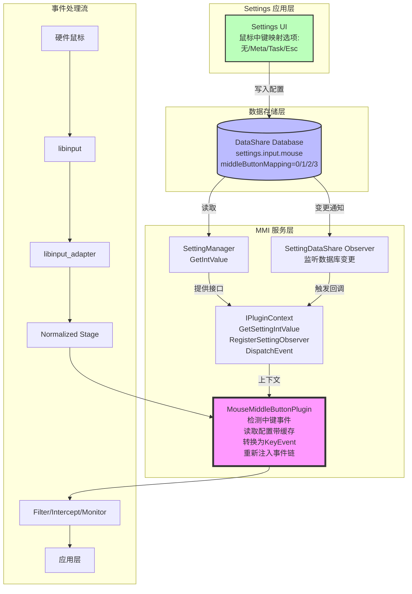
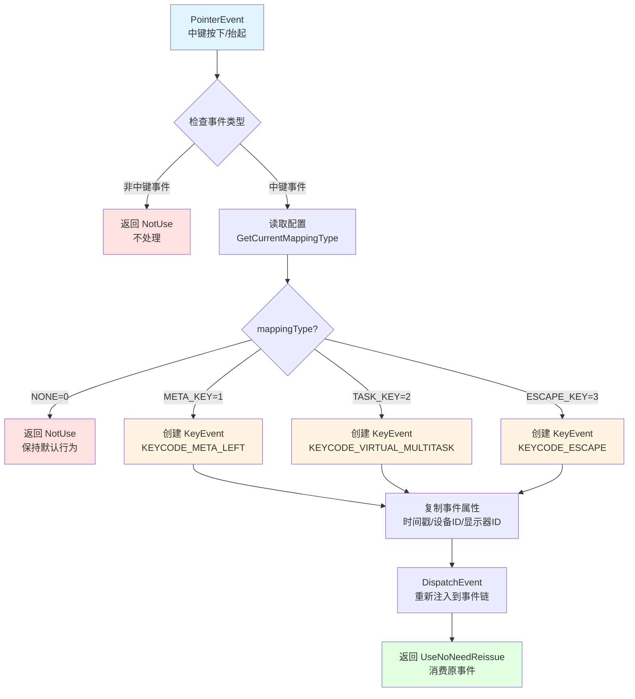
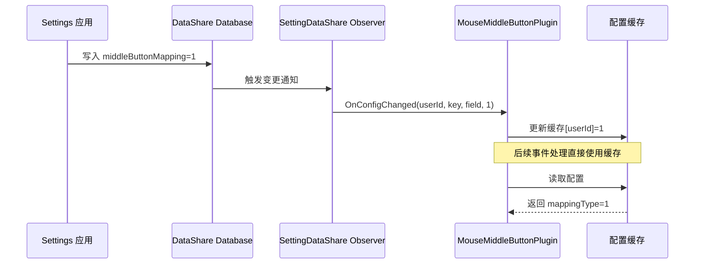

# 鼠标中键转按键插件实现方案

## 1. 需求概述

实现一个插件，将鼠标中键点击转换为可配置的按键事件（Meta/Task/Esc），配置项从数据库读取，由Settings应用负责写入。

### 1.1 核心功能

- 将鼠标中键按下/抬起事件转换为指定的按键事件
- 支持4种映射模式：
  - NONE (0): 不转换，保持默认行为
  - META_KEY (1): 转换为Meta键（Win键/Command键）
  - TASK_KEY (2): 转换为任务切换键
  - ESCAPE_KEY (3): 转换为Esc键
- 配置从数据库读取，支持实时更新
- 支持多用户独立配置

### 1.2 设计原则

1. **配置驱动**：所有行为由配置决定，Settings应用负责写入配置
2. **无侵入**：通过插件机制实现，最小化对核心框架的修改
3. **高性能**：使用缓存机制，避免频繁数据库访问
4. **实时生效**：配置变更立即生效，无需重启服务
5. **向后兼容**：默认不转换，不影响现有用户

## 2. 系统架构

### 2.1 整体架构图



### 2.2 事件转换流程图



### 2.3 配置变更流程图



## 3. 配置管理方案

### 3.1 配置项定义

#### 3.1.1 配置字段（setting_types.h）

```cpp
// 鼠标中键映射配置字段
const std::string FIELD_MOUSE_MIDDLE_BUTTON_MAPPING = "middleButtonMapping";

// 鼠标配置字段白名单（添加新字段）
const std::set<std::string> MOUSE_SETTING_FIELDS = {
    FIELD_MOUSE_SCROLL_ROWS,
    FIELD_MOUSE_PRIMARY_BUTTON,
    FIELD_MOUSE_POINTER_SPEED,
    FIELD_MOUSE_HOVER_SCROLL_STATE,
    FIELD_MOUSE_POINTER_COLOR,
    FIELD_MOUSE_POINTER_SIZE,
    FIELD_MOUSE_POINTER_STYLE,
    FIELD_MOUSE_SCROLL_DIRECTION,
    FIELD_MOUSE_MIDDLE_BUTTON_MAPPING  // 新增
};
```

#### 3.1.2 配置值定义（setting_constants.h）

```cpp
// 鼠标中键映射类型
enum class MiddleButtonMappingType : int32_t {
    NONE = 0,        // 不转换（默认行为）
    META_KEY = 1,    // 转换为Meta键
    TASK_KEY = 2,    // 转换为Task键
    ESCAPE_KEY = 3   // 转换为Esc键
};

// 默认值
const int32_t DEFAULT_MIDDLE_BUTTON_MAPPING =
    static_cast<int32_t>(MiddleButtonMappingType::NONE);
```

#### 3.1.3 数据库字段（setting_constants.cpp）

```cpp
const std::vector<std::string> SETTING_FIELDS_NUM = {
    FIELD_MOUSE_SCROLL_ROWS,
    FIELD_MOUSE_PRIMARY_BUTTON,
    FIELD_MOUSE_POINTER_SPEED,
    FIELD_MOUSE_POINTER_COLOR,
    FIELD_MOUSE_POINTER_SIZE,
    FIELD_MOUSE_POINTER_STYLE,
    FIELD_MOUSE_MIDDLE_BUTTON_MAPPING,  // 新增
    FIELD_TOUCHPAD_SCROLL_ROWS,
    FIELD_TOUCHPAD_POINTER_SPEED,
    FIELD_KEYBOARD_REPEAT_RATE,
    FIELD_KEYBOARD_REPEAT_RATE_DELAY,
    FIELD_TOUCHPAD_RIGHT_CLICK_TYPE
};
```

### 3.2 配置访问接口

#### 3.2.1 配置写入

**由Settings应用直接操作数据库**，multimodalinput不提供写入接口。

Settings应用通过DataShare接口写入：
```cpp
// Settings应用侧代码示例
DataShareHelper::Insert(uri,
    key="settings.input.mouse",
    field="middleButtonMapping",
    value=1);
```

#### 3.2.2 配置读取

插件通过IPluginContext接口读取：
```cpp
// 插件中读取配置
int32_t mappingType = DEFAULT_MIDDLE_BUTTON_MAPPING;
context_->GetSettingIntValue(userId, MOUSE_KEY_SETTING,
    FIELD_MOUSE_MIDDLE_BUTTON_MAPPING, mappingType);
```

### 3.3 配置变更监听

#### 3.3.1 配置变更流程

```
Settings应用修改配置
    ↓
DataShare数据库触发变更通知
    ↓
SettingDataShare Observer接收通知
    ↓
调用插件注册的回调函数
    ↓
插件更新配置缓存
    ↓
后续事件使用新配置
```

#### 3.3.2 观察者注册

```cpp
// 插件注册配置观察者
auto callback = [this](int32_t userId, const std::string &settingKey,
                      const std::string &field, int32_t newValue) {
    this->OnConfigChanged(userId, settingKey, field, newValue);
};

observerId_ = context_->RegisterSettingObserver(
    MOUSE_KEY_SETTING,
    FIELD_MOUSE_MIDDLE_BUTTON_MAPPING,
    callback);
```

## 4. 框架接口扩展

### 4.1 IPluginContext接口扩展（plugin_stage.h）

```cpp
struct IPluginContext {
    // ... 现有接口 ...

    // 配置读取接口（只读）
    virtual int32_t GetSettingIntValue(
        int32_t userId,
        const std::string &settingKey,
        const std::string &field,
        int32_t &value) = 0;

    // 配置变更监听接口
    using SettingChangeCallback = std::function<void(
        int32_t userId,
        const std::string &settingKey,
        const std::string &field,
        int32_t newValue)>;

    virtual int32_t RegisterSettingObserver(
        const std::string &settingKey,
        const std::string &field,
        SettingChangeCallback callback) = 0;

    virtual bool UnregisterSettingObserver(int32_t observerId) = 0;
};
```

**注意**：不提供SetSettingIntValue接口，配置写入由Settings应用直接操作数据库。

### 4.2 InputPlugin实现（multimodal_input_plugin_manager.h/cpp）

#### 4.2.1 头文件声明

```cpp
struct InputPlugin : public IPluginContext {
    // ... 现有方法 ...

    int32_t GetSettingIntValue(
        int32_t userId,
        const std::string &settingKey,
        const std::string &field,
        int32_t &value) override;

    int32_t RegisterSettingObserver(
        const std::string &settingKey,
        const std::string &field,
        SettingChangeCallback callback) override;

    bool UnregisterSettingObserver(int32_t observerId) override;
};
```

#### 4.2.2 实现代码

```cpp
int32_t InputPlugin::GetSettingIntValue(
    int32_t userId,
    const std::string &settingKey,
    const std::string &field,
    int32_t &value)
{
    auto settingManager = INPUT_SETTING_MANAGER;
    CHKPR(settingManager, RET_ERR);
    return settingManager->GetIntValue(userId, settingKey, field, value);
}

int32_t InputPlugin::RegisterSettingObserver(
    const std::string &settingKey,
    const std::string &field,
    SettingChangeCallback callback)
{
    CHKPR(callback, RET_ERR);

    int32_t userId = GetCurrentAccountId();
    if (userId < 0) {
        MMI_HILOGE("Failed to get current account id");
        return RET_ERR;
    }

    std::string uri = "datashare:///com.ohos.settingsdata/entry/settingsdata/USER_SETTINGSDATA_"
                      + std::to_string(userId) + "?Proxy=true";

    // 配置变更时重新读取新值并调用回调
    auto updateFunc = [this, callback, settingKey, field, userId](const std::string& key) {
        int32_t newValue = 0;
        auto settingManager = INPUT_SETTING_MANAGER;
        if (settingManager != nullptr) {
            int32_t ret = settingManager->GetIntValue(userId, settingKey, field, newValue);
            if (ret == RET_OK) {
                callback(userId, settingKey, field, newValue);
            }
        }
    };

    // 使用现有的SettingDataShare创建观察者
    auto settingDataShare = std::make_shared<SettingDataShare>();
    CHKPR(settingDataShare, RET_ERR);

    auto observer = settingDataShare->CreateObserver(settingKey, updateFunc);
    CHKPR(observer, RET_ERR);

    bool ret = settingDataShare->RegisterObserver(observer, uri);
    if (!ret) {
        MMI_HILOGE("Failed to register setting observer");
        return RET_ERR;
    }

    // 生成观察者ID并返回
    static int32_t nextObserverId = 0;
    int32_t observerId = nextObserverId++;

    MMI_HILOGI("Setting observer registered, id: %{public}d", observerId);
    return observerId;
}

bool InputPlugin::UnregisterSettingObserver(int32_t observerId)
{
    // 注销观察者实现
    MMI_HILOGI("Unregister setting observer, id: %{public}d", observerId);
    return true;
}
```

## 5. 插件实现方案

### 5.1 插件目录结构

```
service/plugin/mouse_middle_button/
├── include/
│   ├── mouse_middle_button_plugin.h      # 插件接口定义
│   └── middle_button_converter.h         # 转换器
├── src/
│   ├── mouse_middle_button_plugin.cpp    # 插件实现
│   └── middle_button_converter.cpp       # 转换逻辑
├── BUILD.gn                               # 编译配置
└── README.md                              # 文档
```

### 5.2 插件核心类设计

#### 5.2.1 MouseMiddleButtonPlugin类（mouse_middle_button_plugin.h）

```cpp
class MouseMiddleButtonPlugin : public IInputPlugin {
public:
    MouseMiddleButtonPlugin();
    ~MouseMiddleButtonPlugin() override = default;

    // IInputPlugin接口实现
    int32_t GetPriority() const override { return 100; }
    const std::string GetVersion() const override { return "1.0.0"; }
    const std::string GetName() const override { return "MouseMiddleButtonPlugin"; }
    InputPluginStage GetStage() const override {
        return InputPluginStage::INPUT_AFTER_NORMALIZED;
    }

    PluginResult HandleEvent(libinput_event *event,
        std::shared_ptr<IPluginData> data) const override;
    PluginResult HandleEvent(std::shared_ptr<KeyEvent> keyEvent,
        std::shared_ptr<IPluginData> data) const override;
    PluginResult HandleEvent(std::shared_ptr<PointerEvent> pointerEvent,
        std::shared_ptr<IPluginData> data) const override;
    PluginResult HandleEvent(std::shared_ptr<AxisEvent> axisEvent,
        std::shared_ptr<IPluginData> data) const override;
    void HandleMonitorStatus(bool monitorStatus,
        const std::string &monitorType) const override;

    // 设置插件上下文
    void SetContext(std::shared_ptr<IPluginContext> context);
    int32_t GetObserverId() const { return observerId_; }
    std::shared_ptr<IPluginContext> GetContext() const { return context_; }
    void RegisterConfigObserver();

private:
    std::shared_ptr<IPluginContext> context_;
    std::unique_ptr<MiddleButtonConverter> converter_;

    // 配置缓存（按用户ID独立缓存）
    mutable std::map<int32_t, std::atomic<int32_t>> mappingCache_;
    mutable std::mutex cacheMutex_;

    // 配置观察者ID
    int32_t observerId_ = -1;

    // 获取当前用户的配置
    int32_t GetCurrentMappingType() const;

    // 检查是否需要转换
    bool ShouldConvert(std::shared_ptr<PointerEvent> pointerEvent) const;

    // 执行转换
    void ConvertAndDispatch(std::shared_ptr<PointerEvent> pointerEvent,
        int64_t frameTime) const;

    // 配置变更回调
    void OnConfigChanged(int32_t userId, const std::string &settingKey,
        const std::string &field, int32_t newValue);
};
```

#### 5.2.2 MiddleButtonConverter类（middle_button_converter.h）

```cpp
class MiddleButtonConverter {
public:
    MiddleButtonConverter() = default;
    ~MiddleButtonConverter() = default;

    // 转换PointerEvent到KeyEvent
    std::shared_ptr<KeyEvent> Convert(
        std::shared_ptr<PointerEvent> pointerEvent,
        SettingConstants::MiddleButtonMappingType mappingType) const;

private:
    // 根据映射类型获取按键码
    int32_t GetKeyCodeByMappingType(
        SettingConstants::MiddleButtonMappingType mappingType) const;

    // 复制事件属性
    void CopyEventAttributes(
        std::shared_ptr<KeyEvent> keyEvent,
        std::shared_ptr<PointerEvent> pointerEvent) const;
};
```


### 5.3 核心转换逻辑

#### 5.3.1 HandleEvent(PointerEvent)实现

```cpp
PluginResult MouseMiddleButtonPlugin::HandleEvent(
    std::shared_ptr<PointerEvent> pointerEvent,
    std::shared_ptr<IPluginData> data) const
{
    CHKPR(pointerEvent, PluginResult::NotUse);
    CHKPR(context_, PluginResult::NotUse);

    // 检查是否需要转换
    if (!ShouldConvert(pointerEvent)) {
        return PluginResult::NotUse;
    }

    // 获取配置（从缓存）
    int32_t mappingType = GetCurrentMappingType();
    if (mappingType == static_cast<int32_t>(SettingConstants::MiddleButtonMappingType::NONE)) {
        return PluginResult::NotUse;  // 不转换，保持默认行为
    }

    // 执行转换并分发
    ConvertAndDispatch(pointerEvent, data->frameTime);

    // 消费原事件，阻止继续传递
    return PluginResult::UseNoNeedReissue;
}
```

#### 5.3.2 ShouldConvert()实现

```cpp
bool MouseMiddleButtonPlugin::ShouldConvert(
    std::shared_ptr<PointerEvent> pointerEvent) const
{
    // 检查事件类型
    int32_t action = pointerEvent->GetPointerAction();
    if (action != PointerEvent::POINTER_ACTION_BUTTON_DOWN &&
        action != PointerEvent::POINTER_ACTION_BUTTON_UP) {
        return false;
    }

    // 检查按键ID
    int32_t buttonId = pointerEvent->GetButtonId();
    if (buttonId != PointerEvent::MOUSE_BUTTON_MIDDLE) {
        return false;
    }

    // 检查源类型
    int32_t sourceType = pointerEvent->GetSourceType();
    if (sourceType != PointerEvent::SOURCE_TYPE_MOUSE) {
        return false;
    }

    return true;
}
```

#### 5.3.3 ConvertAndDispatch()实现

```cpp
void MouseMiddleButtonPlugin::ConvertAndDispatch(
    std::shared_ptr<PointerEvent> pointerEvent,
    int64_t frameTime) const
{
    // 获取映射类型
    int32_t mappingType = GetCurrentMappingType();
    auto mappingEnum = static_cast<SettingConstants::MiddleButtonMappingType>(mappingType);

    // 转换事件
    auto keyEvent = converter_->Convert(pointerEvent, mappingEnum);
    if (!keyEvent) {
        MMI_HILOGE("Failed to convert pointer event to key event");
        return;
    }

    // 重新分发到事件处理链
    context_->DispatchEvent(keyEvent, frameTime);

    MMI_HILOGD("Converted middle button to key event, keyCode:%{public}d, action:%{public}d",
        keyEvent->GetKeyCode(), keyEvent->GetKeyAction());
}
```

#### 5.3.4 GetCurrentMappingType()实现

```cpp
int32_t MouseMiddleButtonPlugin::GetCurrentMappingType() const
{
    // 获取当前用户ID
    int32_t userId = context_->GetCurrentAccountId();

    // 从缓存读取
    std::lock_guard<std::mutex> lock(cacheMutex_);
    auto it = mappingCache_.find(userId);
    if (it != mappingCache_.end()) {
        return it->second.load();
    }

    // 缓存未命中，从数据库读取
    int32_t mappingType = SettingConstants::DEFAULT_MIDDLE_BUTTON_MAPPING;
    context_->GetSettingIntValue(userId, MOUSE_KEY_SETTING,
        FIELD_MOUSE_MIDDLE_BUTTON_MAPPING, mappingType);

    // 更新缓存
    mappingCache_[userId].store(mappingType);

    return mappingType;
}
```

#### 5.3.5 OnConfigChanged()实现

```cpp
void MouseMiddleButtonPlugin::OnConfigChanged(
    int32_t userId,
    const std::string &settingKey,
    const std::string &field,
    int32_t newValue)
{
    if (settingKey != MOUSE_KEY_SETTING ||
        field != FIELD_MOUSE_MIDDLE_BUTTON_MAPPING) {
        return;
    }

    // 更新缓存
    std::lock_guard<std::mutex> lock(cacheMutex_);
    mappingCache_[userId].store(newValue);

    MMI_HILOGI("Middle button mapping updated for user %{public}d: %{public}d",
        userId, newValue);
}
```

#### 5.3.6 RegisterConfigObserver()实现

```cpp
void MouseMiddleButtonPlugin::RegisterConfigObserver()
{
    CHKPV(context_);

    auto callback = [this](int32_t userId, const std::string &settingKey,
                          const std::string &field, int32_t newValue) {
        this->OnConfigChanged(userId, settingKey, field, newValue);
    };

    observerId_ = context_->RegisterSettingObserver(
        MOUSE_KEY_SETTING,
        FIELD_MOUSE_MIDDLE_BUTTON_MAPPING,
        callback);

    if (observerId_ < 0) {
        MMI_HILOGE("Failed to register setting observer");
    } else {
        MMI_HILOGI("Setting observer registered, id: %{public}d", observerId_);
    }
}
```

### 5.4 转换器实现

#### 5.4.1 Convert()实现

```cpp
std::shared_ptr<KeyEvent> MiddleButtonConverter::Convert(
    std::shared_ptr<PointerEvent> pointerEvent,
    SettingConstants::MiddleButtonMappingType mappingType) const
{
    CHKPR(pointerEvent, nullptr);

    // 创建KeyEvent
    auto keyEvent = KeyEvent::Create();
    CHKPR(keyEvent, nullptr);

    // 设置按键码
    int32_t keyCode = GetKeyCodeByMappingType(mappingType);
    keyEvent->SetKeyCode(keyCode);

    // 设置按键动作
    int32_t pointerAction = pointerEvent->GetPointerAction();
    int32_t keyAction = (pointerAction == PointerEvent::POINTER_ACTION_BUTTON_DOWN)
        ? KeyEvent::KEY_ACTION_DOWN
        : KeyEvent::KEY_ACTION_UP;
    keyEvent->SetKeyAction(keyAction);

    // 复制事件属性
    CopyEventAttributes(keyEvent, pointerEvent);

    return keyEvent;
}
```

#### 5.4.2 GetKeyCodeByMappingType()实现

```cpp
int32_t MiddleButtonConverter::GetKeyCodeByMappingType(
    SettingConstants::MiddleButtonMappingType mappingType) const
{
    switch (mappingType) {
        case SettingConstants::MiddleButtonMappingType::META_KEY:
            return KeyEvent::KEYCODE_META_LEFT;
        case SettingConstants::MiddleButtonMappingType::TASK_KEY:
            return KeyEvent::KEYCODE_VIRTUAL_MULTITASK;
        case SettingConstants::MiddleButtonMappingType::ESCAPE_KEY:
            return KeyEvent::KEYCODE_ESCAPE;
        default:
            return KeyEvent::KEYCODE_UNKNOWN;
    }
}
```

#### 5.4.3 CopyEventAttributes()实现

```cpp
void MiddleButtonConverter::CopyEventAttributes(
    std::shared_ptr<KeyEvent> keyEvent,
    std::shared_ptr<PointerEvent> pointerEvent) const
{
    // 复制时间戳
    keyEvent->SetActionTime(pointerEvent->GetActionTime());
    keyEvent->SetActionStartTime(pointerEvent->GetActionStartTime());

    // 复制设备信息
    keyEvent->SetDeviceId(pointerEvent->GetDeviceId());
    keyEvent->SetTargetDisplayId(pointerEvent->GetTargetDisplayId());

    // 复制窗口信息
    keyEvent->SetTargetWindowId(pointerEvent->GetTargetWindowId());
    keyEvent->SetAgentWindowId(pointerEvent->GetAgentWindowId());
}
```

### 5.5 插件导出函数

```cpp
extern "C" {

int32_t InitPlugin(std::shared_ptr<IPluginContext> ctx,
                   std::shared_ptr<IInputPlugin>& plugin)
{
    CHKPR(ctx, RET_ERR);

    auto mousePlugin = std::make_shared<MouseMiddleButtonPlugin>();
    if (!mousePlugin) {
        MMI_HILOGE("Failed to create MouseMiddleButtonPlugin");
        return RET_ERR;
    }

    // 保存上下文引用
    mousePlugin->SetContext(ctx);

    // 注册配置观察者
    mousePlugin->RegisterConfigObserver();

    plugin = mousePlugin;
    MMI_HILOGI("MouseMiddleButtonPlugin initialized successfully");
    return RET_OK;
}

int32_t UnintPlugin(std::shared_ptr<IInputPlugin> plugin)
{
    CHKPR(plugin, RET_ERR);

    // 注销配置观察者
    auto mousePlugin = std::dynamic_pointer_cast<MouseMiddleButtonPlugin>(plugin);
    if (mousePlugin && mousePlugin->GetObserverId() >= 0) {
        mousePlugin->GetContext()->UnregisterSettingObserver(
            mousePlugin->GetObserverId());
    }

    MMI_HILOGI("MouseMiddleButtonPlugin uninitialized");
    return RET_OK;
}

} // extern "C"
```

## 6. BUILD.gn配置

```gn
import("//build/ohos.gni")
import("//foundation/multimodalinput/input/multimodalinput_mini.gni")

config("mouse_middle_button_plugin_config") {
  visibility = [ ":*" ]
  include_dirs = [
    "include",
    "${mmi_path}/service/setting_manager/include",
    "${mmi_path}/interfaces/native/innerkits/event/include",
    "${mmi_path}/interfaces/native/innerkits/common/include",
    "${mmi_path}/util/common/include",
  ]
}

ohos_shared_library("libmouse_middle_button_plugin") {
  sources = [
    "src/middle_button_converter.cpp",
    "src/mouse_middle_button_plugin.cpp",
  ]

  configs = [ ":mouse_middle_button_plugin_config" ]

  deps = [
    "${mmi_path}/util:libmmi-util",
  ]

  external_deps = [
    "c_utils:utils",
    "hilog:libhilog",
  ]

  innerapi_tags = [ "platformsdk" ]
  part_name = "input"
  subsystem_name = "multimodalinput"

  install_images = [ "system" ]
  install_enable = true
  module_install_dir = "lib64/multimodalinput/autorun"
}
```

## 7. 关键文件清单

| 文件路径 | 修改类型 | 说明 |
|---------|---------|------|
| `interfaces/native/innerkits/event/include/plugin_stage.h` | **修改** | 扩展IPluginContext接口（配置读取+观察者） |
| `service/module_loader/include/multimodal_input_plugin_manager.h` | **修改** | InputPlugin类添加新方法声明 |
| `service/module_loader/src/multimodal_input_plugin_manager.cpp` | **修改** | 实现配置访问和观察者接口 |
| `service/setting_manager/include/setting_types.h` | 修改 | 添加FIELD_MOUSE_MIDDLE_BUTTON_MAPPING |
| `service/setting_manager/include/setting_constants.h` | 修改 | 添加MiddleButtonMappingType枚举 |
| `service/setting_manager/src/setting_constants.cpp` | 修改 | 添加字段到SETTING_FIELDS_NUM |
| `service/plugin/mouse_middle_button/include/mouse_middle_button_plugin.h` | 新建 | 插件接口定义 |
| `service/plugin/mouse_middle_button/include/middle_button_converter.h` | 新建 | 转换器定义 |
| `service/plugin/mouse_middle_button/src/mouse_middle_button_plugin.cpp` | 新建 | 插件实现 |
| `service/plugin/mouse_middle_button/src/middle_button_converter.cpp` | 新建 | 转换逻辑实现 |
| `service/plugin/mouse_middle_button/BUILD.gn` | 新建 | 编译配置 |

## 8. 关键设计决策

1. **配置写入**：由Settings应用直接操作数据库，multimodalinput不提供写入接口
2. **配置读取**：插件通过IPluginContext::GetSettingIntValue()读取
3. **配置监听**：利用现有的SettingDataShare观察者机制，监听数据库变更
4. **按键映射**：
   - Meta键 → KEYCODE_META_LEFT
   - Task键 → KEYCODE_VIRTUAL_MULTITASK
   - Esc键 → KEYCODE_ESCAPE
5. **多用户支持**：每个用户独立缓存配置，使用map<userId, config>
6. **插件加载**：始终加载，放在/system/lib64/multimodalinput/autorun/
7. **事件分发**：使用context_->DispatchEvent(keyEvent, frameTime)
8. **默认行为**：NONE（不转换），保持向后兼容

## 9. 验证方案

### 9.1 单元测试

创建`service/plugin/mouse_middle_button/test/unittest/`：

**测试用例**：
- 测试配置读取（各种映射类型）
- 测试事件检测逻辑（中键/非中键）
- 测试转换逻辑（PointerEvent → KeyEvent）
- 测试配置变更通知
- 测试多用户场景

### 9.2 集成测试

```bash
# 1. 编译并安装插件
./build.sh --product-name rk3568 --build-target libmouse_middle_button_plugin

# 2. 推送到设备
hdc file send out/rk3568/multimodalinput/input/libmouse_middle_button_plugin.so \
    /system/lib64/multimodalinput/autorun/

# 3. 重启MMI服务
hdc shell "killall multimodalinput"

# 4. 设置配置（通过Settings应用或命令行）
# 方式1：通过Settings数据库
hdc shell "settings put settings.input.mouse middleButtonMapping 1"  # Meta键
hdc shell "settings put settings.input.mouse middleButtonMapping 2"  # Task键
hdc shell "settings put settings.input.mouse middleButtonMapping 3"  # Esc键
hdc shell "settings put settings.input.mouse middleButtonMapping 0"  # 不转换

# 方式2：通过SQL直接修改（调试用）
hdc shell "sqlite3 /data/service/el1/public/database/settings_data.db \
  \"UPDATE settingsdata SET VALUE='1' WHERE KEY='settings.input.mouse' \
  AND FIELD='middleButtonMapping'\""

# 5. 查看日志
hdc shell "hilog | grep MouseMiddleButton"

# 6. 测试鼠标中键点击
# 观察系统响应：
# - mappingType=1: 应触发Meta键菜单
# - mappingType=2: 应触发任务切换
# - mappingType=3: 应触发Esc行为（关闭对话框等）
# - mappingType=0: 保持原始中键行为（粘贴等）

# 7. 测试配置实时生效
# 在不重启服务的情况下修改配置，验证立即生效
```

### 9.3 性能测试

- 测试配置读取性能（缓存命中率）
- 测试事件转换延迟（应 < 1ms）
- 测试高频点击场景（连续快速点击中键）

## 10. 实现优先级

### P0（核心功能 - 第一阶段）

1. **框架接口扩展**：
   - IPluginContext添加配置访问接口
   - InputPlugin实现配置访问方法

2. **配置管理**：
   - 添加配置字段定义
   - 添加枚举类型定义

3. **插件基本功能**：
   - 插件框架搭建
   - 中键检测逻辑
   - 事件转换逻辑（Meta/Task/Esc）
   - 事件分发

### P1（增强功能 - 第二阶段）

1. **配置观察者**：
   - 插件注册配置监听
   - 实时配置更新

2. **性能优化**：
   - 配置缓存机制
   - 多用户配置隔离

3. **测试完善**：
   - 单元测试
   - 集成测试
   - 性能测试

### P2（可选功能 - 未来扩展）

1. 更多按键映射选项（Home/Back/Menu等）
2. 组合键支持（Ctrl+中键等）
3. 条件转换（根据应用/窗口类型）
4. 配置导入导出

## 11. 注意事项

### 11.1 线程安全

- 配置缓存使用atomic和mutex保护
- 观察者回调可能在不同线程执行
- 事件处理在主线程，配置读取需要线程安全

### 11.2 性能优化

- 使用缓存避免频繁数据库访问
- 配置变更时才更新缓存
- 事件检测逻辑尽量简单高效

### 11.3 错误处理

- 配置读取失败使用默认值（NONE）
- 转换失败记录日志但不影响系统
- 观察者注册失败不影响基本功能

### 11.4 向后兼容

- 配置项不存在时使用默认值
- 默认不转换，不影响现有鼠标中键功能
- 插件加载失败不影响系统运行

### 11.5 用户体验

- 配置实时生效，无需重启
- 默认不转换，不影响现有用户
- 支持多用户独立配置

### 11.6 日志记录

关键路径添加日志：
- 插件加载/卸载
- 配置读取/变更
- 事件转换
- 错误情况

## 12. 总结

本方案通过以下方式实现了鼠标中键到按键的可配置转换：

### 核心优势

1. **框架扩展**：在IPluginContext中提供配置访问和监听接口，插件可以方便地访问配置
2. **配置驱动**：从数据库读取配置，支持Settings应用动态修改
3. **实时生效**：通过观察者模式，配置变更立即通知插件
4. **高性能**：使用缓存机制，避免频繁数据库访问
5. **可扩展**：易于添加更多映射类型和转换规则
6. **无侵入**：通过插件机制实现，核心框架改动最小化
7. **用户友好**：支持多用户配置隔离，默认不影响现有功能

### 关键技术点

- IPluginContext接口扩展（配置访问 + 观察者）
- SettingDataShare观察者机制复用
- 插件配置缓存和实时更新
- PointerEvent到KeyEvent的转换
- 事件重新分发到处理链

### 实现路径

1. 扩展框架接口（IPluginContext）
2. 实现配置管理（SettingManager集成）
3. 开发插件核心功能（检测、转换、分发）
4. 实现配置监听（观察者模式）
5. 性能优化（缓存机制）
6. 测试验证（单元测试、集成测试）

